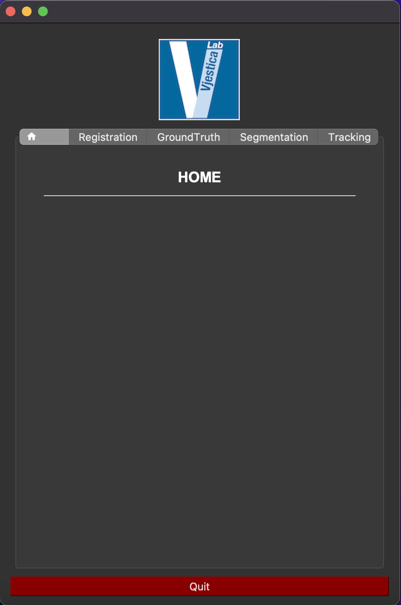

# VLabApplication

Automating cellular image analysis


## About The Project

<div align="center"></div>

The VLabApp is created with the aim of automating the cellular image analysis process, from the recording of the movies that come out of the microscope, to the tracking of the events within each time frame.

The application is divided into several modules that can be used consecutively and/or independently:
* **Registration** - to register and align images.
* **Z-Projection** - to make a projection of the z stack. Max, min, std, average and median projections possible.
* **Segmentation** - to segment the images and generate the corresponding masks.
* **Cell tracking** - to track segmented cells over time and create the cell tracking graph.
* **Graph filtering** - to filter and clean the graph and the corresponding mask.
* **Events filter** - to filter Fusion and Division events and get their corresponding masks and graphs.
* **Pipeline** - to create a pipeline by combining individual modules.
* **Viewers** - to easily view the generated images, masks, graphs, registration matrix in Napari.
* **File organization** - to export or clean generated output.
* **Ground truth generator** - to quickly and easily generate the ground truth masks useful for a possible retraining of the network to be used in the Segmentation module.


## Getting Started


### Installation

The use of Anaconda is supposed.
 
1. Create a virtual environment for your code, in the terminal: 
    ```
    conda create --name venv_VLabApp  python=3.11
    ```
 
2. Once the venv is created, activate it: 
    ```
    conda activate venv_VLabApp
    ```

3. Clone this git repository. Open the terminal where you want to put the App code (eg. Desktop): 
    ```
    git clone https://github.com/vjesticalab/VLabApp.git
    ```
    Now you have the VLabApp folder into the chosen directory (eg. Desktop/VLabApp)

4. Open the terminal within the VLabApp, activate your venv and install the libraries running:
    ```
    conda install -c pytorch -c conda-forge --file requirements.txt
    ```
    Now you have everything you need to use the Application!

5. To open the application, run:
    ```
    python3 master.py
    ```


### On Linux

Be careful on the limit of files that you are allowed to open. The parallelisation of some modules could open up to 1000 files per process. 
Therefore, the limit could be as follows:

```
ulimit -n 10000
python3 master.py
```

This would be enough for a 10 CPU machine.


## Documentation


### Methods description

Registration module:

[modules/registration_module/doc/METHODS.md](modules/registration_module/doc/METHODS.md)

Z-Projection module:

[modules/zprojection_module/doc/METHODS.md](modules/zprojection_module/doc/METHODS.md)

Cell tracking module:

[modules/cell_tracking_module/doc/METHODS.md](modules/cell_tracking_module/doc/METHODS.md)


## License

Distributed under the ... License. See `support_files/LICENSE.txt` for more information.


## Credits

Arianna Ravera - Scientific Computing and Research Support Unit, [University of Lausanne](https://www.unil.ch).

Julien Dorier - Bioinformatics Competence Center, [University of Lausanne](https://www.unil.ch).

Aleksandar Vjestica - Center for Integrative Genomics, [University of Lausanne](https://www.unil.ch).

Project Link: [VLabApp](https://github.com/vjesticalab/VLabApp)


