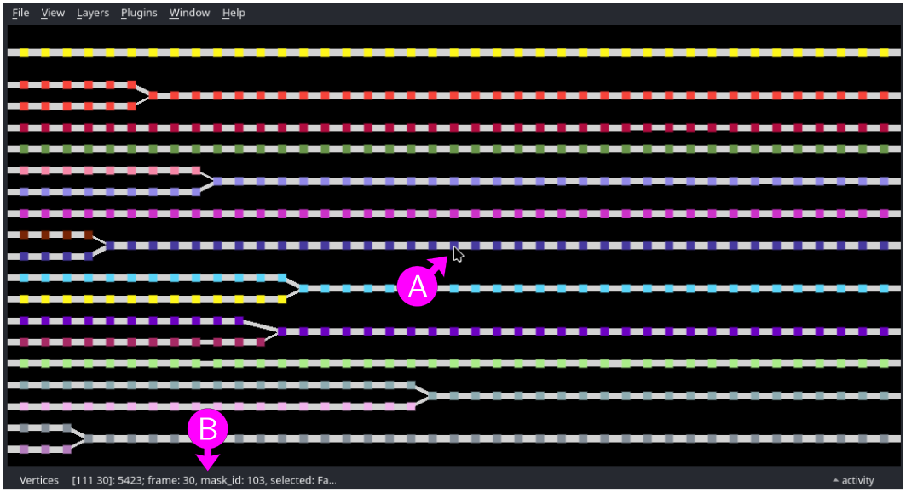
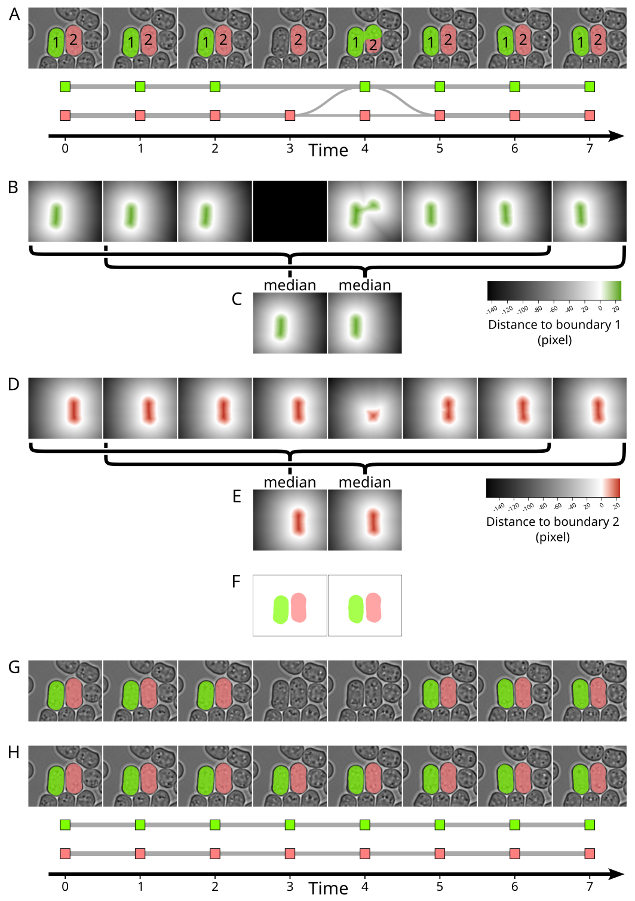
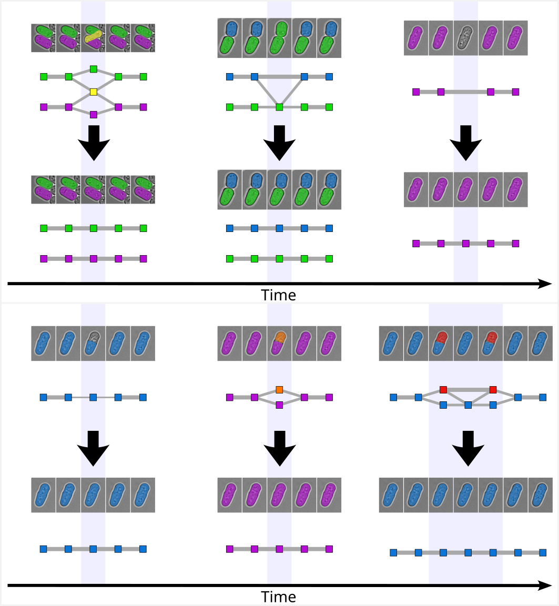

# Cell tracking module

The cell tracking module allows tracking segmented cells over time. It takes segmentation masks as input, performs cell tracking and generates relabelled segmentation masks with corresponding cell tracking graphs. The cell tracking algorithm used in this module is based on the assumption that cell movement is limited between consecutive time frames. In particular, any global drift should be corrected using the registration module before performing cell tracking.

## Input files

A list of multi-dimensional segmentation masks with `X`, `Y` and `T` axes (see [File formats - images and masks](../general/files.md#images-and-masks) for more information).

To populate the list, use the <kbd>Add file</kbd>, <kbd>Add folder</kbd> and <kbd>Remove selected</kbd> buttons to add masks, folder (all masks inside the folder) or remove masks from the list. Alternatively, masks and folder can be dragged and dropped from an external file manager.

When adding files or folders, only files satisfying all filters (click on `▶` above the list to show filters) are added to the list. By default, only files with a filename containing `_vSM` (segmentation masks generated with the segmentation module) and ending with one of the accepted file extensions (`.nd2`, `.tif`, `.tiff`, `.ome.tif`, `.ome.tiff`) are accepted.


## Parameters

Output folder
: Either use each input mask folder as output folder or specify a
custom output folder. To select a custom folder, either paste the path
into the text box, click on the <kbd>Browse</kbd> button, or drag and drop a
folder from an external file manager. Be careful when using a custom folder: if
two input files share the same filename (from different folders), the
output for both files will be written to the same output files,
resulting in data corruption.

Output suffix
: The output filename will correspond to the input filename with an
additional `_vTG` suffix, optionally followed by a user defined suffix
(containing only `a-z`, `A-Z`, `0-9` and `-` characters). The
resulting output filenames are shown below the suffix.

Min area
: Remove labelled regions with area (number of pixels) below this value.

Max delta frame
: Number of previous time frames to consider when creating the cell tracking graph. See [Cell tracking](#cell-tracking) in the appendix for more information.

Min overlap fraction
: Minimum overlap fraction (w.r.t labelled region area) to consider when creating edges in the cell tracking graph. See [Cell tracking](#cell-tracking) in the appendix for more information.

Automatic cleaning
: If checked, perform automatic cleaning of the cell tracking graph to correct punctual defects (such as missing or mislabeled cells).  See [Correction of segmentation errors](#correction-of-segmentation-errors) in the appendix for more information.

Stable overlap fraction
: Cell tracking graph edges corresponding to an overlap fraction below this value are considered as not stable. See [Correction of segmentation errors](#correction-of-segmentation-errors) in the appendix for more information.

Max defect size (frames)
: Maximum size of the defect (number of frames). See [Correction of segmentation errors](#correction-of-segmentation-errors) in the appendix for more information.

Max delta frame (interpolation)
: Number of previous and subsequent time frames to consider for mask interpolation. See [Correction of segmentation errors](#correction-of-segmentation-errors) in the appendix for more information.

Min stable size (frames)
: Minimum number of stable time frames before and after the defect. See [Correction of segmentation errors](#correction-of-segmentation-errors) in the appendix for more information.

Multi-processing
: Number of processes to use for coarse-grain parallelization (memory
usage increases with the number of processes). This setting is only
useful if there are multiple input masks, as each input mask will be
assigned to its own process.

Show (and edit) results in napari
: If checked, the resulting segmentation mask and cell tracking graph are shown in [napari](https://napari.org) for visual inspection and editing. This option is disabled if there is more than one input segmentation mask.

Input image
: Multi-dimensional image to display in napari together with segmentation mask and cell tracking graph (optional). This image should have at least `T`, `X`, and `Y` axes (with same size as the segmentation mask), and optionally `Z` and `C` axes (see [File formats - images and masks](../general/files.md#images-and-masks) for more information). To select an image, either paste the path into the text box, click on the <kbd>Browse</kbd> button, or drag and drop a file from an external file manager.


## Editing with napari

<figure>

<figcaption>Figure 1: napari window with a segmentation mask overlaid on top of a bright-field image.</figcaption>
</figure>

<figure>

<figcaption>Figure 2: napari window with the cell tracking graph associated with the segmentation mask shown in Figure 1.</figcaption>
</figure>

If the "Show (and edit) results in napari" option is selected, the resulting relabelled segmentation mask and cell tracking graph are shown in [napari](https://napari.org), each in its own window (Figures 1 and 2).

### Inspecting the segmentation mask and cell tracking graph

Figure 1 shows the napari window with the segmentation mask, optionally overlaid on the image (Figure 1A). There is one layer per image channel (`C` axis) and one layer for the segmentation mask (Figure 1B). Additionally, there is one slider for the time axis (`T`, Figure 1C) and one slider the `Z` axis if the image is present and has a `Z` axis (Figure 1C).

Figure 2 shows the napari window with the cell tracking graph. Vertices (squares) correspond to labelled regions (cells) at a given time frame. Edges correspond to overlap between labelled regions. Vertices are ordered by time along the horizontal axis (time increases from left to right).

Both windows support panning and zooming with a mouse or touchpad. Selecting a specific `T` or `Z` axis position can be done using the respective axis slider.

For the following, make sure that the "Cell mask" layer is selected (Figure 1B). When hovering over a labelled region in the segmentation mask (Figure 1D), the corresponding mask id is shown in the status bar (mask id 103, Figure 1E). Similarly, when hovering over a vertex in the cell tracking graph (Figure 2A), the corresponding time frame and mask id are shown in the status bar (time frame 30, mask id 103, Figure 2B).

Click (left mouse button) on a labelled region in the segmentation mask to center the view on the corresponding vertex in the cell tracking graph view.
Click (left mouse button) on a vertex of the cell tracking graph to center the segmentation mask view on the corresponding labelled region and time frame (`T` axis slider).

Right-clicking on a labelled region in the segmentation mask or vertex in the cell tracking graph selects it (selected vertices are shown with a white border). Right-clicking while pressing the <kbd>SHIFT</kbd> key extends the selection.


### Automatic cleaning

Click on the <kbd>Clean</kbd> button to automatically search for punctual defects in the cell tracking graph and try to remove them by interpolating corresponding mask across neighboring time frames (Figure 1F, see [Correction of segmentation errors](#correction-of-segmentation-errors) in the appendix for more information). The following parameters are available:

Stable overlap fraction
: Cell tracking graph edges corresponding to an overlap fraction below this value are considered as not stable.

Max defect size (frames)
: Maximum size of the defect (number of frames).

Max delta frame (interpolation)
: Number of previous and subsequent time frames to consider for mask interpolation.

Min stable size (frames)
: Minimum number of stable frames before and after the defect.

Min area
: Remove labelled regions with area (number of pixels) below this value.

Clean "missing" mask only
: If checked, only consider "missing" mask defects.

Add a layer with mask modifications
: If checked, add a new layer that shows modifications made to the segmentation mask (red: removed regions, blue: modified regions, green: added regions).


### Correcting selected punctual defects

Click on the <kbd>Interpolate selection</kbd> button to interpolate selected labelled regions across neighboring time frames (Figure 1G, see [Mask interpolation](#mask-interpolation) in the appendix for more information). Labelled regions are selected by clicking with the right mouse button. Right-clicking while pressing the <kbd>SHIFT</kbd> key extends the selection. The following parameters are available:

Max delta frame (interpolation)
: Number of previous and subsequent time frames to consider for mask interpolation.

Min area
: Remove labelled regions with area (number of pixels) below this value.

Add a layer with mask modifications
: If checked, add a new layer that shows modifications made to the segmentation mask (red: removed regions, blue: modified regions, green: added regions).


### Manual error correction

If interpolation is not sufficient to correct defects, it is possible to manually correct the segmentation mask by using the "Cell mask" layer drawing tools (Figure 1H). Note that the cell tracking graph is not updated automatically when editing the segmentation mask (this operation is too computationally intensive). To relabel the segmentation mask and recompute the cell tracking graph, click on the <kbd>Relabel</kbd> button (Figure 1I). 


### Relabelling

The relabelling operation splits disconnected labelled regions, removes small labelled regions, recompute cell tracking graph and relabel the mask so as to have consistent mask ids in consecutive time frame (Figure 1I, see  [Cell tracking](#cell-tracking) in the appendix for more information).

Relabelling should be done before saving if the "Interpolate selection tools" has been used, or directly after manually editing the segmentation mask. 
To perform relabelling, click on the <kbd>Relabel</kbd> button. The following parameters are available:

Max delta frame
: Number of previous time frames to consider when creating the cell tracking graph.

Min area
: Remove labelled regions with area (number of pixels) below this value.

Min overlap fraction
: Minimum overlap fraction (w.r.t labelled region area) to consider when creating edges in the cell tracking graph.


### Saving

Click on the <kbd>Save</kbd> (or <kbd>Relabel & Save</kbd>) button to save the segmentation mask and cell tracking graph.
Note that when showing and editing results in napari, the segmentation mask and cell tracking graph are not saved until clicking on the <kbd>Save</kbd> button.

### Closing the napari windows

To close the napari windows, click on the <kbd>Quit</kbd> button (Figure 1J).
Do not use the "Close window" option in the "File" menu nor the window close button, as it may crash the application. Do not use "Exit" option in the "File" menu, as it will close the full VLabApp application.

## Output files

* Relabelled segmentation mask (see [File formats - images and masks](../general/files.md#images-and-masks) for more information).
* Cell tracking graph (see [File formats - Cell tracking graphs](../general/files.md#cell-tracking-graphs) for more information).
* Log file (see [File formats - Log files and metadata](../general/files.md#log-files-and-metadata) for more information).

Output filenames are obtained by adding a `_vTG` suffix to the input filename, optionally followed by a user defined suffix. For example, with input segmentation mask
```
smp01_BF_vSM.ome.tif
```
the output segmentation mask, cell tracking graph and log file will have filenames:
```
smp01_BF_vSM_vTG.ome.tif
smp01_BF_vSM_vTG.graphmlz
smp01_BF_vSM_vTG.log
```


## Appendix: Cell tracking method

### Cell tracking

#### Terminology

Terminology is illustrated in Figure 3:

* **Image**: original input image (e.g. bright-field image after Z-projection), below we assume it has axes T (time), Y, X and a unique channel (bright-field).
* **Mask**: an image with same dimension as the input image and a unique channel (segmented object label). Masks are usually generated by a segmentation algorithm (e.g. Cellpose), but can also be created manually.
* **Label**: An integer ID (mask id) assigned to each segmented object (in this document, labels are represented by colors).
* **labelled region**: sets of pixels assigned to a specific label (at a specific time frame).

<figure>

<figcaption>Figure 3: Terminology.</figcaption>
</figure>


#### Cell tracking graph: creation

The cell tracking graph is created by assigning one vertex to each labelled region (one vertex per time frame) and one edge between each overlapping pair of labelled region (considering only pairs of labelled region separated by not more than $N_\text{t}$ time frames). The overlap area is stored as an edge attribute.
An example of cell tracking graph obtained with $N_\text{t}=2$ is shown in Figure 4.

Note: $N_\text{t}$ is called "Max delta frame" in the GUI.

<figure>

<figcaption>Figure 4: Top: mask with labelled regions (color) overlaid on top of bright-field image. Bottom: cell tracking graph (obtained with N<sub>t</sub>=2). Vertex color denotes the corresponding labelled region and edge thickness denotes the overlap area. Horizontal axis corresponds to time</figcaption>
</figure>


#### Relabelling

As illustrated in Figure 4, labelled region are usually obtained
independently for each frame and labels (colors) do not match across
time frames.  To obtain consistent labels across time, we use the
following iterative relabelling approach (see Figure 5):

1. Labelled regions (vertices) in the first time frame ($t=0$) are
   arbitrarily relabelled using consecutive integer labels $1$, $2$, $3$,
   $\cdots$ (Figure 5A).

2. We then iterate over the remaining time frames (Figure 5B-F).

    * At time frame $t$ ($t>0$), we evaluate a "confusion matrix",
      containing the total overlap area between each labelled region
      (vertex) at time frame t and each labelled region (vertex) at
      previous time frames. Note that all previous time frames ($t-1$,
      $t-2$, $\cdots$) have already been relabelled.
      Each row of the confusion matrix corresponds to a labelled region
      (vertex) in the current frame t, while each column corresponds to
      a labelled region (vertex) in previous frames ($t-1$, $t-2$, $\cdots$,
      $t-N_\text{t}$).
      The entry in the $i$-th row and $j$-th column contain sum of the
      overlap areas between the labelled region (with label
      corresponding to row $i$) and all labelled regions (with label
      corresponding to column $j$) in the previous time frames $t-1$, $t-2$,
      $\cdots$, $t-N_\text{t}$. It is evaluated by summing the overlap areas stored as
      edge attribute for all edges connecting the vertex with label
      corresponding to row $i$ at time frame t to all vertices with label
      corresponding to column $j$ at previous time frames (dark grey
      edges in Figure 5).
 
    * One to one matching between labels in the current time frame
      (rows) and labels in previous time frames (columns) is found
      using *linear sum assignment* ([scipy](https://scipy.org/)
      implementation, using the opposite of the confusion matrix as
      cost matrix). Labels in the current time frame are replaced by
      the matching labels in previous time frames. If the confusion
      matrix contains more rows than columns, some labels in current
      time frame do not match any labels in previous time frames. In
      this case, unmatched labels are replaced by new labels $m+1$,
      $m+2$, $\cdots$ (with $m$ the maximum label found across all
      previous time frames).

The resulting relabelled cell tracking graph and mask are shown in Figure 6


<figure>

<figcaption>Figure 5: Iterative relabelling of the cell tracking graph. Panel A: first time frame (t=0) with corresponding vertices highlighted (white outline) and arbitrarily relabelled 1 (magenta) and 2 (green). Panels B-F: each panel corresponds to one time frame (t=1, ..., 5). Vertices corresponding to the current time frame are highlighted (white outline). Edge connecting vertices in the current time frame to vertices in previous time frames are shown in dark grey, together with the corresponding overlap area (black number). The confusion matrix is shown below the graph. Labels associated with each column/row are indicated (color). Matching between labels in the current time frame (rows) and labels in previous time frames (columns) by linear sum assignment is indicated using a bold font.</figcaption>
</figure>


<figure>

<figcaption>Figure 6: Relabelled mask and cell tracking graph.</figcaption>
</figure>


#### Cell tracking graph: cleaning

The final cell tracking graph is obtained by (see Figure 7):

* Removing edges corresponding to low overlap: Edges with an overlap
  area smaller than a predefined fraction $f$ (20% by default) of any
  the labelled region area corresponding to the source or target
  vertices (dashed edges in Figure 7).

* Adding missing edges between vertices with same label: If two
  consecutive (in time) vertices with same label are not connected by
  an edge, then add the missing edge between these vertices (Figure
  8). This could happen after removing low overlap edges.

* Removing redundant edges: Intuitively, a redundant edges is an edge
  *enclosing* another edge (light grey edges in Figure 7).  More
  precisely, an edge connecting a vertex with label $L_1$ at time
  frame $t_1$ to a vertex with label $L_2$ at time frame $t_2$
  ($t_2>t_1$) is considered as redundant if there is at least one
  other edge connecting a vertex with label $L_1$ at time frame $t'_1$
  to a vertex with label $L_2$ at time frame $t'_2$ and if $t'_1\geq
  t_1$ and $t'_2\leq t_2$.

The resulting final cell tracking graph is shown in Figure 9.

Note: The threshold $f$ used to filter out edges corresponding to low
overlap is called "Min overlap fraction" in the GUI.


<figure>

<figcaption>Figure 7: Cell tracking graph cleaning. Dashed grey lines denote edges corresponding to low overlap and solid light grey lines denotes redundant edges. </figcaption>
</figure>

<figure>

<figcaption>Figure 8: Adding missing edges (blue). This made-up example is not related to Figure 7.</figcaption>
</figure>

<figure>

<figcaption>Figure 9: Final cell tracking graph.</figcaption>
</figure>


### Correction of segmentation errors

#### Mask interpolation

Cell segmentation tools (e.g. Cellpose) may occasionally produce
errors (e.g. time frames 3 and 4 in Figure 10A).  When segmentation
errors are punctual and surrounded (in time) by stable and error-free
time frames, it is possible to correct the error using the information
contained in neighboring time frames ("interpolating" neighboring time
frames).

To "interpolate" a set of labelled regions (labels 1=green and 2=red
in Figure 10) over a range of time frames (t=3 and t=4 in Figure 10)
using the information contained in $N_\text{i}$ neighbouring frames on each
side ($N_\text{i}=3$ by default), we start by evaluating the signed distance
map for each labelled region and each time frame separately (Figure 10B
and 10D). Each pixel in the distance map contain pixel the signed
distance from this pixel to the boundary of the labelled region, with
positive distance inside the labelled region and negative distances
outside.  For each selected labelled region and each selected time
frame, we evaluate the median of all distance maps for the labelled
region at time frames within $\pm N_\text{i}$ of the selected time frame
(Figure 10C and 10E).

For each selected time frame, new labelled regions are obtained by
assigning each pixel to the label with highest positive median
distance map (Figure 10F). Pixels with negative median distance for all
labelled regions are assigned to the background.

The final mask is obtained by erasing (i.e setting to background
label) selected labelled regions in selected time frames (Figure 10G)
and pasting non-background pixels from the new labelled regions
(Figure 10F) onto the final mask (Figure 10H).

Note: $N_\text{i}$ is called "Max delta frame (interpolation)" in the GUI.

<figure>

<figcaption>Figure 10: Mask correction. A: mask (overlaid on top of bright-field image) and corresponding cell tracking graph with segmentation errors in time frames 3 and 4 (made-up example). B: distance maps for labelled region 1. All pixels of the distance map at time frame 3 (missing labelled region) are set to minus infinity. C: median distance maps for labelled region 1. D and E: same as B and C but for labelled region 2. F: updated labelled regions 1 and 2 obtained by combining median distance maps. G: original mask (A) after setting labelled regions 1 and 2 to background for selected time frames 3 and 4. H: Final mask (overlaid on top of bright-field image) and corresponding cell tracking graph after merging masks F and G.</figcaption>
</figure>


#### Automatic correction of punctual defects

The previous "mask interpolation" method can be applied to any user
selected set of labelled regions and time frames.
However, it may not give reasonable results if the labelled regions
are not stable enough within $\pm N_\text{i}$ time frames around the
frames to be corrected.

Intuitively, this method should work best for punctual segmentation
errors (i.e. spanning only few time frames), surrounded by enough stable and
error-free time frames.
To automatically find this type of segmentation defects, we use the
information contained in the cell tracking graph:

**Stable regions**: Intuitively, a stable region of the cell tracking graph is a series of vertices in consecutive time frames (no missing time frame), all corresponding to the same mask label, each with a unique incoming and a unique outgoing edge (no branching).

More precisely, we start by flagging all edges of the cell tracking graph as *stable* or *not stable*.
An edge is defined as stable if and only if it satisfies all the following criteria (Figure 11):

* Its source and target vertices correspond to the same mask label.
* Its source and target vertices are in consecutive frames.
* Its source vertex has a unique outgoing edge (this edge) and its target vertex has a unique incoming edge (this edge).
* The overlap between labelled regions corresponding to source and target vertices is larger than a predefined fraction $f$ (90% by default) of any the labelled region area corresponding to the source or target vertices.

Examples of *not stable* edges are shown in Figure 11 (blue letters):

* Edge (a) is not stable because its source vertex has two outgoing edges.
* Edge (b) is not stable because the overlap between labelled regions corresponding to source and target vertices is too low.
* Edge (c) is not stable because its source and target vertices are not in consecutive frames.
* Edge (d) is not stable because its target vertex has two incoming edges.
* Edge (e) is not stable because its source and target vertices do have same label (color) and its target vertex has two incoming edges.

<figure>

<figcaption>Figure 11: Examples of stable (dark grey) and not stable (light grey) edges. Vertex color denotes the corresponding label and edge thickness denotes the overlap area. </figcaption>
</figure>

Stable regions are found as the connected components of the subgraph induced by all *stable* edges. The size of each stable region is measured as the number of vertices in connected component (Figure 12).

<figure>

<figcaption>Figure 12: Size (red text) of stable regions (dark grey edges, colored vertices).</figcaption>
</figure>

**Punctual defects**: Candidate defects are found as the connected components of the subgraph induced by all *not stable* edges (ignoring trivial components of size 1).

This initial list of candidate defects (connected components) is then filtered out to keep only punctual defects surrounded by stable regions, satisfying all the following criteria (see Figure 13):

* The time frame interval covered by the connected component is not larger than $N_\text{d}+2$ frames, where $N_\text{d}$ is a user specified maximum defect size  (2 by default). I.e. the defect is punctual.
* The set of labels associated with vertices in the first time frame of the connected component is identical to the set of labels associated with vertices in the last time frame of the connected component. I.e. the defect is stable, in the sense that the same segmented objects are present before and after the defect.
* Each vertex in first and in last time frame of the connected component belongs to a stable region (see above) of size $\geq N_\text{s}$, where $N_\text{s}$ is a user specified minimum stable region size (3 by default). I.e. the defect is surrounded by stable regions.

Figure 13 and 14 show exemples of candidate defects. For $N_\text{d}=2$ and $N_\text{s}=3$, the following candidate defects would be filtered out:

* Candidate defect (a): it does not have the same set of labels in first frame (blue) and in last frame (blue and green). Note that this candidate defect corresponds to a cell division (i.e. not a defect).
* Candidate defect (d): it covers 5 frames ($>N_\text{d}+2$) and the vertex in last time frame belongs to a stable region of size 2 ($\lt N_\text{s}$). Note that with $N_\text{d}\geq 3$ this candidate defect would not be filtered out.
* Candidate defect (h): it does not have the same set of labels in first frame (green and purple) and in last frame (purple) and the vertex in last time frame belongs to a stable region of size 2 ($\lt N_\text{s}$). Note that this candidate defect corresponds to cell fusion with a labelled region missing (green, time frame 18), which cannot be corrected by this method.

<figure>

<figcaption>Figure 13: Candidate defects (dark grey edges, colored vertices, identified with blue letters). Sizes of neighboring stable regions are indicated in red. </figcaption>
</figure>

<figure>

<figcaption>Figure 14: Labelled regions (made-up examples) corresponding to the candidate defects in Figure 13. </figcaption>
</figure>


Finally, for each remaining defect in the list, the  mask interpolation method described in the previous section is applied to the list of all labels appearing in the defect, for all time frames covered by the defect except first and last time frame (Figure 15).

<figure>

<figcaption>Figure 15: Mask interpolation method applied to punctual defects (figure 13). The mask interpolation method is applied to all labels appearing in the defect and all highlighted time frames (light blue).</figcaption>
</figure>


Notes:

* $f$ is called "Stable overlap fraction" in the GUI.
* $N_\text{d}$ is called "Max defect size" in the GUI.
* $N_\text{s}$ is called "Min stable size" in the GUI.
* Ideally, the user defined parameters should satisfy $N_\text{d}\leq N_\text{i}\leq N_\text{s}$ (with $N_\text{i}$ the size of the neighboring region used for mask interpolation).


