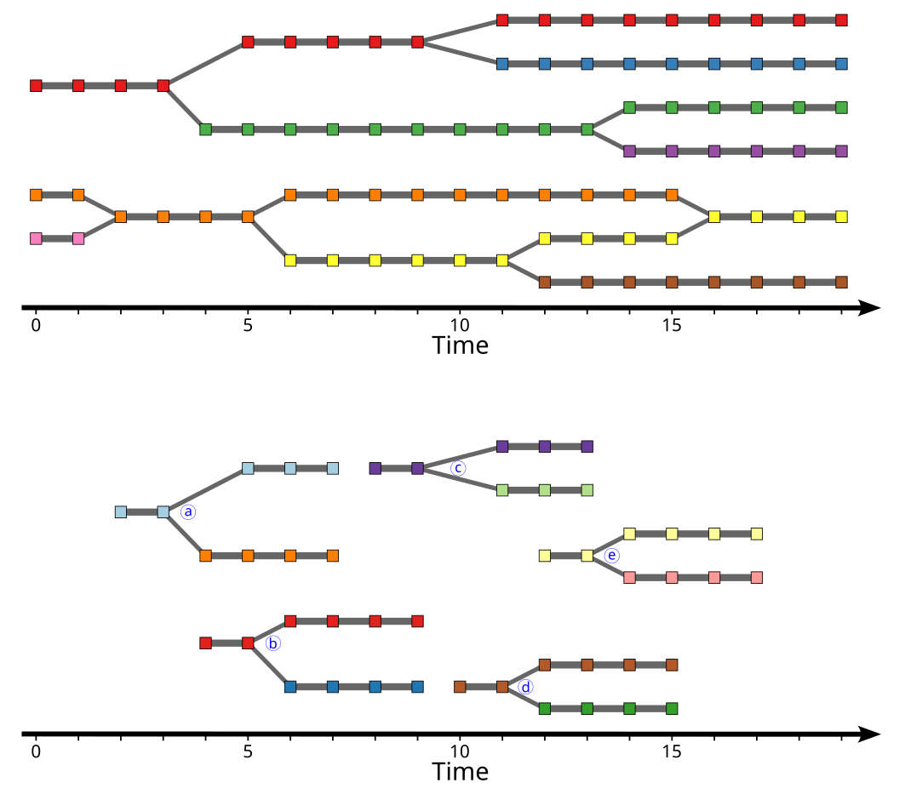

# Events selection module

The events selection module extracts fusion or division events. It takes pairs of segmentation masks and cell tracking graphs as input, searches for fusion or division events, selects cells within a user-specified time window around each event, and saves the resulting mask and graph containing only the selected cells (Figure 1).

<figure>

<figcaption>Figure 1: selection of division events. Top: original cell tracking graph. Bottom: cell tracking graph after selecting division events with 2 frames before event, 4 frames each events and allowing up to 2 missing cells.</figcaption>
</figure>


## Input files

A list of multi-dimensional segmentation masks with `X`, `Y` and `T` axes (see [File formats - images and masks](../general/files.md#images-and-masks) for more information) with corresponding cell tracking graphs (see [File formats - Cell tracking graphs](../general/files.md#cell-tracking-graphs) for more information).

Corresponding mask and graph files must be in the same folder. Their filenames must share the same basename and end with the suffixes specified below the table (by default `<basname>.ome.tif` and <basename>.graphmlz).

To populate the table, use the <kbd>Add file</kbd>, <kbd>Add folder</kbd> and <kbd>Remove selected</kbd> buttons to add masks or graphs, folder (all masks and graphs inside the folder) or remove rows from the list. Alternatively, masks, graphs and folders can be dragged and dropped from an external file manager. Masks (resp. graphs) without a corresponding graph (resp. mask) are ignored.

When adding files or folders, only files satisfying all filters (click on `▶` above the list to show filters) are added to the list. By default, only pairs of mask and graph with a filename containing `_vTG` (segmentation masks and cell tracking graphs generated with the cell tracking module) and ending with the suffixes specified below the table (`.ome.tif` and `.graphmlz`) are accepted.


## Parameters

Output folder
: Either use each input mask/graph folder as output folder or specify a
custom output folder. To select a custom folder, either paste the path
into the text box, click on the <kbd>Browse</kbd> button, or drag and drop a
folder from an external file manager. Be careful when using a custom folder: if
two input files share the same filename (from different folders), the
output for both files will be written to the same output file,
resulting in data corruption.

Output suffix
: The output filename will correspond to the input filename with an
additional `_vES` suffix, optionally followed by a user defined suffix
(containing only `a-z`, `A-Z`, `0-9` and `-` characters). The
resulting output filenames are shown below the suffix.

Type of events
: The type of events to select (`division` or `fusion`).

Number of frames (before event)
: Number of stable frames to keep before the event. Events without the required number of stable frames before the event are not selected.

Number of frames (after event)
: Number of stable frames to keep after the event. Events without the required number of stable frames after the event are not selected.

Border filter
: If checked, ignore events with at least one cell of the corresponding cell track touching the border of the image.

Border width (pixel)
: Width of the image border (in pixel).

Missing cells filter
: If checked, ignore events with more than the specified number of missing cells (missing cells are only allowed immediately around the fusion/division event).

Max missing cells
: Maximum number of missing cells for the missing cells filter.

Multi-processing
: Number of processes to use for coarse-grain parallelization (memory
usage increases with the number of processes). This setting is only
useful if there are multiple input mask and graph, as each pair of input mask and graph will be
assigned to its own process.


## Output files

* Filtered segmentation mask (see [File formats - images and masks](../general/files.md#images-and-masks) for more information).
* Filtered Cell tracking graph (see [File formats - Cell tracking graphs](../general/files.md#cell-tracking-graphs) for more information).
* Log file (see [File formats - Log files and metadata](../general/files.md#log-files-and-metadata) for more information).

Output filenames are obtained by adding a `_vES` suffix to the input filename, optionally followed by a user defined suffix. For example, with input segmentation mask and cell tracking graph
```
smp01_BF_vSM_vTG.ome.tif
smp01_BF_vSM_vTG.graphmlz
```
the output segmentation mask, cell tracking graph and log file will have filenames:
```
smp01_BF_vSM_vTG_vES.ome.tif
smp01_BF_vSM_vTG_vES.graphmlz
smp01_BF_vSM_vTG_vES.log
```
