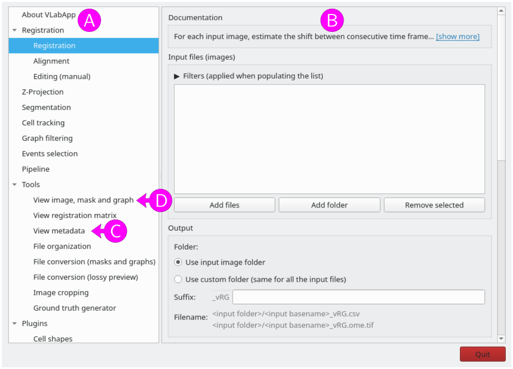

# Tutorial

## Preparation

If not done yet, install VLabApp (see [Installation](../general/installation.md) for more information).

Create a working directory `example1/` and copy the sample bright-field image ([doc/data/smp01_BF.ome.tif](../../data/smp01_BF.ome.tif)) and fluorescent image ([doc/data/smp01_WL450.ome.tif](../../data/smp01_WL450.ome.tif)) from the VLabApp sub-folder `doc/data/` to the working directory `example1/`:


Open a terminal or anaconda powershell prompt (Windows) and navigate to the VLabApp folder.
Activate the conda environment
```
conda activate venv_VLabApp
```
and start VLabApp with
```
python master.py
```


## VLabApp interface

VLabApp is a collection of independent modules. Each module loads selected input files, processes them, and saves the resulting output files in the same folder (unless otherwise specified).

The interface is composed of two panels: a list of modules on the left (Figure 1A), and a panel that provides settings and controls for the selected module on the right (Figure 1B).

<figure>

<figcaption>Figure 1: VLabApp user interface.</figcaption>
</figure>


## Viewing images and metadata

Select "View metadata" from the left panel (Figure 1C).
The right panel will display the settings for this module. All modules begin with a "Documentation" section, which can be expanded by clicking "[show more]". This section contains basic information about the module and the expected input files. For additional information, click the "Documentation" link at the end of the section. This will open the VLabApp documentation in a web browser.

Click the  <kbd>Browse</kbd> button to open a file selection dialog. Navigate to the `example1/` folder and select the bright-field image `smp01_BF.ome.tif`. Alternatively, paste the path to the image into the text box, or drag and drop the image from an external file manager into the text box.

The image metadata will be displayed in the lower part of the panel:
```
Dimensions: (T: 30, Z: 7, Y: 635, X: 651)
Channel names: "BF"
Physical pixel sizes: (X: 0.065015720421583 μm, Y: 0.065015720421583 μm, Z: 1.0 μm)
Data type: uint8
```
Note that this module focuses on metadata generated by VLabApp. Only a limited subset of other image metadata is shown.

This image consists of a time series of 30 frames (`T` axis), each containing 7 Z-sections (`Z` axis). Each Z-section is a 651x635 pixels 2D image (`X` and `Y` axes).
The image has a single channel named "BF". Each pixel has size 0.065 μm in both the X and Y directions and the Z-sections are separated by 1 μm. The data are stored as 8-bit unsigned integers.


Repeat the operation with the second sample image `smp01_WL450.ome.tif` (either adjust the text, use the <kbd>Browse</kbd> button, or drop the file on the text box). The metadata will update to:
```
Dimensions: (T: 30, Y: 635, X: 651)
Channel names: "2-BFP"
Physical pixel sizes: (X: 0.065015720421583 μm, Y: 0.065015720421583 μm, Z: 1.0 μm)
Data type: uint8
```
This image has the same number of time frames and the same X and Y dimensions as the bright-field image, but it does not have multiple Z-sections. It has a single channel named "2-BFP". The physical pixel sizes and data type are the same as those of the bright-field image.
See [View metadata](../viewer_metadata_module/reference.md) for more information on this module.


To view images using [napari](https://napari.org), select "View image, mask and graph" from the left panel (Figure 1D).
In the "Image" field, select the bright-field image `smp01_BF.ome.tif` (use the <kbd>Browse</kbd> button, or drag and drop the file from an external file manager), then click the <kbd>Open napari</kbd> button.

A napari window opens with the bright-field image displayed in the "Image [BF]" layer.
The mouse or touchpad can be used to pan and zoom the view (`X` and `Y` axes).
The `T` and `Z` sliders below the image allow navigation through time frames and Z-sections, respectively.

Layer-specific controls are available in the "Layer controls" panel (top left). Image contrast can be adjusted using the "contrast limits" slider, and the colormap can be changed using the corresponding dropdown. See <https://napari.org/stable/howtos/layers/image.html> for more information on the napari user interface.

The `Z` slider below the image allows navigation through Z-sections. Note how the Z-sections transition from out of focus (Z=0) to best focus (Z=3) and back to out of focus (Z=6).

Set the `Z` slider to the section with best focus (Z=3), and navigate through time frames using the `T` slider. Note how the cells drift to the left.

Close the napari window using the window close button or the "Close window" option in the "File" menu. Do not use the "Exit" option in the "File" menu, as it will close the full VLabApp application.

Repeat the operation with the second sample image `smp01_WL450.ome.tif` (either adjust the text, use the <kbd>Browse</kbd> button, or drop the file on the text box).

See [View image, mask and graph](../viewer_image_mask_graph_module/reference.md) for more information on this module.


## Registration

To correct the drift observed in the previous section, select the "Registration" module in the left panel.

Add the bright-field image to the list of input files by clicking the <kbd>Add files</kbd> button below the list. In the file selection dialog, navigate to the `example1/` folder and select the bright-field image `smp01_BF.ome.tif`. To add all images from a folder, click the <kbd>Add folder</kbd> button and select a folder. To remove an image from the list, select the image and click <kbd>Remove selected</kbd>. It is also possible to drag and drop images or folders from an external file manager into the list.
By default, only files with a filename containing `_BF` (image with a unique bright-field channel), not containing `_vRG` (to avoid already registered images), and ending with one of the supported file extensions (`.nd2`, `.tif`, `.tiff`, `.ome.tif`, `.ome.tiff`) are accepted. To modify this behavior, click on `▶` above the list and adjust the filters.

By default, the output files (transformation matrix and registered image) are saved in the same folder as the input image. To save in another folder, check the "Use custom folder" checkbox in the "Output" panel and specify an output folder in the text box (use the <kbd>Browse</kbd> button, or drag and drop a folder from an external file manager).
Output filenames will correspond to the input filename with an additional `_vRG` suffix, optionally followed by a user defined suffix. The resulting output filenames are shown below the suffix.
For this tutorial, we will keep the default "Use input image folder" and leave the user suffix empty.

The "Options" panel contains several options specific to the this module (see [Registration module - Registration](../registration_module/reference.md#registration) for more information). Keep all settings to their default value, except the "Co-align files with the same unique identifier" checkbox which should be checked. With this option, all files with same unique identifier (starting with `smp01`) will be also transformed using the transformation matrix evaluated on the input image.

Click <kbd>Submit</kbd> to start the registration module.

A status dialog will open, displaying one row per input file (in this example, only one row). When the registration process completes, the column Status will indicate the outcome ("Success" or "Failed").
In case of an error, hover the cursor over the cell marked as "Failed" to view the error message as a tooltip.

Click <kbd>OK</kbd> to close the dialog.

The `example1/` folder should contain the following files:
```
example1/
├── smp01_BF.ome.tif
├── smp01_BF_vRG.csv
├── smp01_BF_vRG.log
├── smp01_BF_vRG.ome.tif
├── smp01_WL450.ome.tif
├── smp01_WL450_vRG.log
└── smp01_WL450_vRG.ome.tif
```
In addition to the original input files (`smp01_BF.ome.tif` and `smp01_WL450.ome.tif`), the folder contains several files with the suffix `_vRG`, indicating that they were generated by the registration module:

* `smp01_BF_vRG.csv` contains the transformation parameters (shifts) detected from the image `smp01_BF.ome.tif`
* `smp01_BF_vRG.ome.tif` is the registered bright-field image, generated by applying the transformation matrix `smp01_BF_vRG.csv` to the original bright-field image `smp01_BF.ome.tif`.
* `smp01_BF_vRG.log` contains a log of the operations performed to generate both `smp01_BF_vRG.csv` and `smp01_BF_vRG.ome.tif`.
* `smp01_WL450_vRG.ome.tif` is the registered fluorescent image, generated by applying the same transformation matrix `smp01_BF_vRG.csv` to the original fluorescent image `smp01_WL450.ome.tif`. This output was produced because co-alignment was requested for images sharing the same unique identifier (`smp01`).
* `smp01_WL450_vRG.log` contains a log of the operations performed to generate `smp01_WL450_vRG.ome.tif`.

All operations performed to generate output files are recorded in the corresponding log file. For example, consider the log file `smp01_BF_vRG.log`, which documents the steps taken to produce `smp01_BF_vRG.csv` and `smp01_BF_vRG.ome.tif`:
```
2025-06-16 10:59:45,292 [INFO] System info:
2025-06-16 10:59:45,292 [INFO] - platform: Linux-6.14.9-200.fc41.x86_64-x86_64-with-glibc2.40
2025-06-16 10:59:45,292 [INFO] - python version: 3.11.11
2025-06-16 10:59:45,292 [INFO] - VLabApp version: 2.3.0
2025-06-16 10:59:45,292 [INFO] - numpy version: 1.26.4
2025-06-16 10:59:45,292 [INFO] - pystackreg version: 0.2.8
2025-06-16 10:59:45,292 [INFO] - opencv version: 4.11.0
2025-06-16 10:59:45,292 [INFO] - skimage version: 0.20.0
2025-06-16 10:59:45,292 [INFO] Input image path: /home/jdoe/example1/smp01_BF.ome.tif
2025-06-16 10:59:45,292 [INFO] Registration method: feature matching (SIFT)
2025-06-16 10:59:45,469 [INFO] Preparing image to evaluate transformation matrix: performing Z-projection
2025-06-16 10:59:45,469 [INFO] Z-Projection: projection type=std, zrange=3 (Range 3 around Z section with best focus), focus method=tenengrad_var, z shift=[0, 0, 0, 0, 0, 0, 0, 0, 0, 0, 0, 0, 0, 0, 0, 0, 0, 0, 0, 0, 0, 0, 0, 0, 0, 0, 0, 0, 0, 0]
2025-06-16 10:59:45,508 [INFO] Z-Projection (F: 0, T: 0, C: 0): std over z in [0, 1, 2, 3, 4, 5, 6] (Best z=3, z shift=0)
2025-06-16 10:59:45,540 [INFO] Z-Projection (F: 0, T: 1, C: 0): std over z in [0, 1, 2, 3, 4, 5, 6] (Best z=3, z shift=0)
2025-06-16 10:59:45,574 [INFO] Z-Projection (F: 0, T: 2, C: 0): std over z in [0, 1, 2, 3, 4, 5, 6] (Best z=3, z shift=0)
2025-06-16 10:59:45,607 [INFO] Z-Projection (F: 0, T: 3, C: 0): std over z in [0, 1, 2, 3, 4, 5, 6] (Best z=3, z shift=0)
2025-06-16 10:59:45,638 [INFO] Z-Projection (F: 0, T: 4, C: 0): std over z in [0, 1, 2, 3, 4, 5, 6] (Best z=3, z shift=0)
2025-06-16 10:59:45,669 [INFO] Z-Projection (F: 0, T: 5, C: 0): std over z in [0, 1, 2, 3, 4, 5, 6] (Best z=3, z shift=0)
2025-06-16 10:59:45,701 [INFO] Z-Projection (F: 0, T: 6, C: 0): std over z in [0, 1, 2, 3, 4, 5, 6] (Best z=3, z shift=0)
2025-06-16 10:59:45,729 [INFO] Z-Projection (F: 0, T: 7, C: 0): std over z in [0, 1, 2, 3, 4, 5, 6] (Best z=3, z shift=0)
2025-06-16 10:59:45,758 [INFO] Z-Projection (F: 0, T: 8, C: 0): std over z in [0, 1, 2, 3, 4, 5, 6] (Best z=3, z shift=0)
2025-06-16 10:59:45,787 [INFO] Z-Projection (F: 0, T: 9, C: 0): std over z in [0, 1, 2, 3, 4, 5, 6] (Best z=3, z shift=0)
2025-06-16 10:59:45,816 [INFO] Z-Projection (F: 0, T: 10, C: 0): std over z in [0, 1, 2, 3, 4, 5, 6] (Best z=3, z shift=0)
2025-06-16 10:59:45,844 [INFO] Z-Projection (F: 0, T: 11, C: 0): std over z in [0, 1, 2, 3, 4, 5, 6] (Best z=3, z shift=0)
2025-06-16 10:59:45,870 [INFO] Z-Projection (F: 0, T: 12, C: 0): std over z in [0, 1, 2, 3, 4, 5, 6] (Best z=3, z shift=0)
2025-06-16 10:59:45,895 [INFO] Z-Projection (F: 0, T: 13, C: 0): std over z in [0, 1, 2, 3, 4, 5, 6] (Best z=3, z shift=0)
2025-06-16 10:59:45,922 [INFO] Z-Projection (F: 0, T: 14, C: 0): std over z in [0, 1, 2, 3, 4, 5, 6] (Best z=3, z shift=0)
2025-06-16 10:59:45,948 [INFO] Z-Projection (F: 0, T: 15, C: 0): std over z in [0, 1, 2, 3, 4, 5, 6] (Best z=3, z shift=0)
2025-06-16 10:59:45,973 [INFO] Z-Projection (F: 0, T: 16, C: 0): std over z in [0, 1, 2, 3, 4, 5, 6] (Best z=3, z shift=0)
2025-06-16 10:59:46,000 [INFO] Z-Projection (F: 0, T: 17, C: 0): std over z in [0, 1, 2, 3, 4, 5, 6] (Best z=3, z shift=0)
2025-06-16 10:59:46,025 [INFO] Z-Projection (F: 0, T: 18, C: 0): std over z in [0, 1, 2, 3, 4, 5, 6] (Best z=3, z shift=0)
2025-06-16 10:59:46,051 [INFO] Z-Projection (F: 0, T: 19, C: 0): std over z in [0, 1, 2, 3, 4, 5, 6] (Best z=3, z shift=0)
2025-06-16 10:59:46,077 [INFO] Z-Projection (F: 0, T: 20, C: 0): std over z in [0, 1, 2, 3, 4, 5, 6] (Best z=3, z shift=0)
2025-06-16 10:59:46,102 [INFO] Z-Projection (F: 0, T: 21, C: 0): std over z in [0, 1, 2, 3, 4, 5, 6] (Best z=3, z shift=0)
2025-06-16 10:59:46,127 [INFO] Z-Projection (F: 0, T: 22, C: 0): std over z in [0, 1, 2, 3, 4, 5, 6] (Best z=3, z shift=0)
2025-06-16 10:59:46,151 [INFO] Z-Projection (F: 0, T: 23, C: 0): std over z in [0, 1, 2, 3, 4, 5, 6] (Best z=3, z shift=0)
2025-06-16 10:59:46,175 [INFO] Z-Projection (F: 0, T: 24, C: 0): std over z in [0, 1, 2, 3, 4, 5, 6] (Best z=3, z shift=0)
2025-06-16 10:59:46,201 [INFO] Z-Projection (F: 0, T: 25, C: 0): std over z in [0, 1, 2, 3, 4, 5, 6] (Best z=3, z shift=0)
2025-06-16 10:59:46,225 [INFO] Z-Projection (F: 0, T: 26, C: 0): std over z in [0, 1, 2, 3, 4, 5, 6] (Best z=3, z shift=0)
2025-06-16 10:59:46,249 [INFO] Z-Projection (F: 0, T: 27, C: 0): std over z in [0, 1, 2, 3, 4, 5, 6] (Best z=3, z shift=0)
2025-06-16 10:59:46,273 [INFO] Z-Projection (F: 0, T: 28, C: 0): std over z in [0, 1, 2, 3, 4, 5, 6] (Best z=3, z shift=0)
2025-06-16 10:59:46,301 [INFO] Z-Projection (F: 0, T: 29, C: 0): std over z in [0, 1, 2, 3, 4, 5, 6] (Best z=3, z shift=0)
2025-06-16 10:59:46,311 [INFO] Preparing image to evaluate transformation matrix: selecting channel 0
2025-06-16 10:59:46,312 [INFO] Evaluating transformation matrix with feature matching (SIFT)
2025-06-16 10:59:51,447 [INFO] Saving transformation matrix to /home/jdoe/example1/smp01_BF_vRG.csv
2025-06-16 10:59:51,448 [INFO] Transforming image
2025-06-16 10:59:51,474 [INFO] Cropping image
2025-06-16 10:59:51,474 [INFO] Saving transformed image to /home/jdoe/example1/smp01_BF_vRG.ome.tif
```
It starts with system information, followed by a list of the operations performed to generate the transformation matrix and the registered image: input file, registration method, projection of the Z-stack, channel selection, method used to evaluate the transformation matrix and output file.

The same information is also stored in the metadata of both output files: `smp01_BF_vRG.csv` and `smp01_BF_vRG.ome.tif`.
To view the metadata, select "View metadata" from the left panel and add `smp01_BF_vRG.csv` to the "File" text box. Repeat the process with `smp01_BF_vRG.ome.tif` to inspect its metadata as well.

Similarly, the log file `smp01_WL450_vRG.log` documents the steps taken to produce `smp01_WL450_vRG.ome.tif`:
```
2025-06-16 10:59:52,002 [INFO] System info:
2025-06-16 10:59:52,002 [INFO] - platform: Linux-6.14.9-200.fc41.x86_64-x86_64-with-glibc2.40
2025-06-16 10:59:52,002 [INFO] - python version: 3.11.11
2025-06-16 10:59:52,002 [INFO] - VLabApp version: 2.3.0
2025-06-16 10:59:52,002 [INFO] - numpy version: 1.26.4
2025-06-16 10:59:52,002 [INFO] - pystackreg version: 0.2.8
2025-06-16 10:59:52,002 [INFO] - opencv version: 4.11.0
2025-06-16 10:59:52,002 [INFO] - skimage version: 0.20.0
2025-06-16 10:59:52,002 [INFO] Input image path: /home/jdoe/example1/smp01_WL450.ome.tif
2025-06-16 10:59:52,002 [INFO] Input transformation matrix path: /home/jdoe/example1/smp01_BF_vRG.csv
2025-06-16 10:59:52,062 [INFO] Transforming image
2025-06-16 10:59:52,065 [INFO] Cropping image
2025-06-16 10:59:52,065 [INFO] Saving transformed image to /home/jdoe/example1/smp01_WL450_vRG.ome.tif
```
Note that the information is limited to the transformation of the image `smp01_WL450.ome.tif`: input files (image and transformation matrix), transformation, cropping and output file.

This information is also stored in the metadata of `smp01_WL450_vRG.ome.tif`, which can be viewed using the "View metadata" module in the left panel:
```
Dimensions: (T: 30, Y: 603, X: 572)
Channel names: "2-BFP"
Physical pixel sizes: (X: 0.065015720421583 μm, Y: 0.065015720421583 μm, Z: 1.0 μm)
Data type: uint8

---------------------------------------------

2025-06-16 10:59:52,002 (VLabApp - registration module) [INFO] System info:
2025-06-16 10:59:52,002 (VLabApp - registration module) [INFO] - platform: Linux-6.14.9-200.fc41.x86_64-x86_64-with-glibc2.40
2025-06-16 10:59:52,002 (VLabApp - registration module) [INFO] - python version: 3.11.11
2025-06-16 10:59:52,002 (VLabApp - registration module) [INFO] - VLabApp version: 2.3.0
2025-06-16 10:59:52,002 (VLabApp - registration module) [INFO] - numpy version: 1.26.4
2025-06-16 10:59:52,002 (VLabApp - registration module) [INFO] - pystackreg version: 0.2.8
2025-06-16 10:59:52,002 (VLabApp - registration module) [INFO] - opencv version: 4.11.0
2025-06-16 10:59:52,002 (VLabApp - registration module) [INFO] - skimage version: 0.20.0
2025-06-16 10:59:52,002 (VLabApp - registration module) [INFO] Input image path: /home/jdoe/example1/smp01_WL450.ome.tif
2025-06-16 10:59:52,002 (VLabApp - registration module) [INFO] Input transformation matrix path: /home/jdoe/example1/smp01_BF_vRG.csv
2025-06-16 10:59:52,062 (VLabApp - registration module) [INFO] Transforming image
2025-06-16 10:59:52,065 (VLabApp - registration module) [INFO] Cropping image
2025-06-16 10:59:52,065 (VLabApp - registration module) [INFO] Saving transformed image to /home/jdoe/example1/smp01_WL450_vRG.ome.tif


Metadata for matrix /home/jdoe/example1/smp01_BF_vRG.csv:
2025-06-16 10:59:45,292 (VLabApp - registration module) [INFO] System info:
2025-06-16 10:59:45,292 (VLabApp - registration module) [INFO] - platform: Linux-6.14.9-200.fc41.x86_64-x86_64-with-glibc2.40
2025-06-16 10:59:45,292 (VLabApp - registration module) [INFO] - python version: 3.11.11
2025-06-16 10:59:45,292 (VLabApp - registration module) [INFO] - VLabApp version: 2.3.0
2025-06-16 10:59:45,292 (VLabApp - registration module) [INFO] - numpy version: 1.26.4
2025-06-16 10:59:45,292 (VLabApp - registration module) [INFO] - pystackreg version: 0.2.8
2025-06-16 10:59:45,292 (VLabApp - registration module) [INFO] - opencv version: 4.11.0
2025-06-16 10:59:45,292 (VLabApp - registration module) [INFO] - skimage version: 0.20.0
2025-06-16 10:59:45,292 (VLabApp - registration module) [INFO] Input image path: /home/jdoe/example1/smp01_BF.ome.tif
2025-06-16 10:59:45,292 (VLabApp - registration module) [INFO] Registration method: feature matching (SIFT)
2025-06-16 10:59:45,469 (VLabApp - registration module) [INFO] Preparing image to evaluate transformation matrix: performing Z-projection
2025-06-16 10:59:45,469 (VLabApp - registration module) [INFO] Z-Projection: projection type=std, zrange=3 (Range 3 around Z section with best focus), focus method=tenengrad_var, z shift=[0, 0, 0, 0, 0, 0, 0, 0, 0, 0, 0, 0, 0, 0, 0, 0, 0, 0, 0, 0, 0, 0, 0, 0, 0, 0, 0, 0, 0, 0]
2025-06-16 10:59:45,508 (VLabApp - registration module) [INFO] Z-Projection (F: 0, T: 0, C: 0): std over z in [0, 1, 2, 3, 4, 5, 6] (Best z=3, z shift=0)
2025-06-16 10:59:45,540 (VLabApp - registration module) [INFO] Z-Projection (F: 0, T: 1, C: 0): std over z in [0, 1, 2, 3, 4, 5, 6] (Best z=3, z shift=0)
2025-06-16 10:59:45,574 (VLabApp - registration module) [INFO] Z-Projection (F: 0, T: 2, C: 0): std over z in [0, 1, 2, 3, 4, 5, 6] (Best z=3, z shift=0)
2025-06-16 10:59:45,607 (VLabApp - registration module) [INFO] Z-Projection (F: 0, T: 3, C: 0): std over z in [0, 1, 2, 3, 4, 5, 6] (Best z=3, z shift=0)
2025-06-16 10:59:45,638 (VLabApp - registration module) [INFO] Z-Projection (F: 0, T: 4, C: 0): std over z in [0, 1, 2, 3, 4, 5, 6] (Best z=3, z shift=0)
2025-06-16 10:59:45,669 (VLabApp - registration module) [INFO] Z-Projection (F: 0, T: 5, C: 0): std over z in [0, 1, 2, 3, 4, 5, 6] (Best z=3, z shift=0)
2025-06-16 10:59:45,701 (VLabApp - registration module) [INFO] Z-Projection (F: 0, T: 6, C: 0): std over z in [0, 1, 2, 3, 4, 5, 6] (Best z=3, z shift=0)
2025-06-16 10:59:45,729 (VLabApp - registration module) [INFO] Z-Projection (F: 0, T: 7, C: 0): std over z in [0, 1, 2, 3, 4, 5, 6] (Best z=3, z shift=0)
2025-06-16 10:59:45,758 (VLabApp - registration module) [INFO] Z-Projection (F: 0, T: 8, C: 0): std over z in [0, 1, 2, 3, 4, 5, 6] (Best z=3, z shift=0)
2025-06-16 10:59:45,787 (VLabApp - registration module) [INFO] Z-Projection (F: 0, T: 9, C: 0): std over z in [0, 1, 2, 3, 4, 5, 6] (Best z=3, z shift=0)
2025-06-16 10:59:45,816 (VLabApp - registration module) [INFO] Z-Projection (F: 0, T: 10, C: 0): std over z in [0, 1, 2, 3, 4, 5, 6] (Best z=3, z shift=0)
2025-06-16 10:59:45,844 (VLabApp - registration module) [INFO] Z-Projection (F: 0, T: 11, C: 0): std over z in [0, 1, 2, 3, 4, 5, 6] (Best z=3, z shift=0)
2025-06-16 10:59:45,870 (VLabApp - registration module) [INFO] Z-Projection (F: 0, T: 12, C: 0): std over z in [0, 1, 2, 3, 4, 5, 6] (Best z=3, z shift=0)
2025-06-16 10:59:45,895 (VLabApp - registration module) [INFO] Z-Projection (F: 0, T: 13, C: 0): std over z in [0, 1, 2, 3, 4, 5, 6] (Best z=3, z shift=0)
2025-06-16 10:59:45,922 (VLabApp - registration module) [INFO] Z-Projection (F: 0, T: 14, C: 0): std over z in [0, 1, 2, 3, 4, 5, 6] (Best z=3, z shift=0)
2025-06-16 10:59:45,948 (VLabApp - registration module) [INFO] Z-Projection (F: 0, T: 15, C: 0): std over z in [0, 1, 2, 3, 4, 5, 6] (Best z=3, z shift=0)
2025-06-16 10:59:45,973 (VLabApp - registration module) [INFO] Z-Projection (F: 0, T: 16, C: 0): std over z in [0, 1, 2, 3, 4, 5, 6] (Best z=3, z shift=0)
2025-06-16 10:59:46,000 (VLabApp - registration module) [INFO] Z-Projection (F: 0, T: 17, C: 0): std over z in [0, 1, 2, 3, 4, 5, 6] (Best z=3, z shift=0)
2025-06-16 10:59:46,025 (VLabApp - registration module) [INFO] Z-Projection (F: 0, T: 18, C: 0): std over z in [0, 1, 2, 3, 4, 5, 6] (Best z=3, z shift=0)
2025-06-16 10:59:46,051 (VLabApp - registration module) [INFO] Z-Projection (F: 0, T: 19, C: 0): std over z in [0, 1, 2, 3, 4, 5, 6] (Best z=3, z shift=0)
2025-06-16 10:59:46,077 (VLabApp - registration module) [INFO] Z-Projection (F: 0, T: 20, C: 0): std over z in [0, 1, 2, 3, 4, 5, 6] (Best z=3, z shift=0)
2025-06-16 10:59:46,102 (VLabApp - registration module) [INFO] Z-Projection (F: 0, T: 21, C: 0): std over z in [0, 1, 2, 3, 4, 5, 6] (Best z=3, z shift=0)
2025-06-16 10:59:46,127 (VLabApp - registration module) [INFO] Z-Projection (F: 0, T: 22, C: 0): std over z in [0, 1, 2, 3, 4, 5, 6] (Best z=3, z shift=0)
2025-06-16 10:59:46,151 (VLabApp - registration module) [INFO] Z-Projection (F: 0, T: 23, C: 0): std over z in [0, 1, 2, 3, 4, 5, 6] (Best z=3, z shift=0)
2025-06-16 10:59:46,175 (VLabApp - registration module) [INFO] Z-Projection (F: 0, T: 24, C: 0): std over z in [0, 1, 2, 3, 4, 5, 6] (Best z=3, z shift=0)
2025-06-16 10:59:46,201 (VLabApp - registration module) [INFO] Z-Projection (F: 0, T: 25, C: 0): std over z in [0, 1, 2, 3, 4, 5, 6] (Best z=3, z shift=0)
2025-06-16 10:59:46,225 (VLabApp - registration module) [INFO] Z-Projection (F: 0, T: 26, C: 0): std over z in [0, 1, 2, 3, 4, 5, 6] (Best z=3, z shift=0)
2025-06-16 10:59:46,249 (VLabApp - registration module) [INFO] Z-Projection (F: 0, T: 27, C: 0): std over z in [0, 1, 2, 3, 4, 5, 6] (Best z=3, z shift=0)
2025-06-16 10:59:46,273 (VLabApp - registration module) [INFO] Z-Projection (F: 0, T: 28, C: 0): std over z in [0, 1, 2, 3, 4, 5, 6] (Best z=3, z shift=0)
2025-06-16 10:59:46,301 (VLabApp - registration module) [INFO] Z-Projection (F: 0, T: 29, C: 0): std over z in [0, 1, 2, 3, 4, 5, 6] (Best z=3, z shift=0)
2025-06-16 10:59:46,311 (VLabApp - registration module) [INFO] Preparing image to evaluate transformation matrix: selecting channel 0
2025-06-16 10:59:46,312 (VLabApp - registration module) [INFO] Evaluating transformation matrix with feature matching (SIFT)
2025-06-16 10:59:51,447 (VLabApp - registration module) [INFO] Saving transformation matrix to /home/jdoe/example1/smp01_BF_vRG.csv
```
It begins with a limited subset of important image metadata (dimension, channel names, physical pixel sizes and data type), followed by the metadata generated by VLabApp. The first block contains the operations used to transform the image (the information contained in the log file `smp01_BF_vRG.log`). Subsequent blocks contain a recursive listing of the metadata from all input files (in this example: only the transformation matrix `smp01_BF_vRG.csv`).
By recursively storing the metadata of all input files, each file contains a complete record of how it was generated. 

It is recommended to verify the results of the registration.  This can be done in two ways:

1. Use the "View image, mask and graph" module in the left panel to view the registered image `smp01_BF_vRG.ome.tif` (add `smp01_BF_vRG.ome.tif` to the "Image" text box and click <kbd>Open napari</kbd>). If the registration procedure was successful, the cells should be globally stable when navigating through time frames with the `T` slider. Note:

    * Although the `Z` axis was projected to evaluate the transformation matrix, the registered image still includes all seven Z-sections from the input image.
    * The `X` and `Y` axes of the registered image have been cropped to the common region shared by all time frames.

2. Select "View registration matrix" from the left panel. This module requires two input files: the original image (`smp01_BF.ome.tif`), which was used as input for the registration module and the corresponding transformation matrix (`smp01_BF_vRG.csv`). Use the <kbd>Browse</kbd> button in the "Registration matrix" box to select the registration matrix `smp01_BF_vRG.csv`. Alternatively, paste the path in the text box or drag and drop the file from an external file manager. The "Image (before registration)" field should automatically populate with the original bright-field image `smp01_BF.ome.tif` (if not, use the <kbd>Browse</kbd> button to select the image). Click <kbd>Open napari</kbd>. If the registration procedure was successful, the cells should be globally stable when navigating through time frames with the `T` slider (see [View registration matrix](../viewer_registration_module/reference.md) for more information on this module).

In case of registration failure, select an alternative registration method ("Registration method" dropdown list in the Registration module settings) and rerun the registration. If this still fails, it is possible to manually correct the transformation using manual editing (see next section).


### Registration - manual editing

For more information on this module, see [Registration module - Editing (manual)](../registration_module/reference.md#editing-manual).

From the left panel, select "Editing (manual)" under the "Registration" group.
This module requires the same two input files as the "View registration matrix" module: the original image (`smp01_BF.ome.tif`), which was used as input for the registration module and the corresponding transformation matrix (`smp01_BF_vRG.csv`). Use the <kbd>Browse</kbd> button in the "Registration matrix" box to select the registration matrix `smp01_BF_vRG.csv`. Alternatively, paste the path in the text box or drag and drop the file from an external file manager. The "Image (before registration)" field should automatically populate with the original bright-field image `smp01_BF.ome.tif` (if not, use the <kbd>Browse</kbd> button to select the image). Click <kbd>Submit</kbd>.

<figure>

<figcaption>Figure 2: Manually editing the registration matrix with napari</figcaption>
</figure>

The unregistered image opens in  [napari](https://napari.org) (Figure 2A), with a graphical representation of the transformation matrix in the lower part of the window (Figure 2B) showing x (red) and y (blue) coordinates of the image offset (vertical axis) as a function of time (horizontal axis). 

The transformation matrix is also represented by a green control point (Figure 2C) overlaid on the image (layer "Alignment points"). The position of the control point is transformed using the transformation matrix (i.e. it should ideally follow the cells in the image). If needed, the transformation matrix can be modified by adjusting the position of the control point at the current time frame (selected with the Z slider), from first to current time frame, or from current time frame to last (the desired behavior can be selected in the right part of the screen, Figure 2D). To move the control point for the selected range of frame, make sure the layer "Alignment points" is selected (Figure 2E), then click at the desired position while pressing the <kbd>CTRL</kbd> key (or <kbd>CMD</kbd> key with Mac OS X).


It is also possible to adjust the range of time frames to use for the transformation by modifying the "From" and "To" fields (Figure 2F).
Registered images generated using a transformation matrix with a limited range of time frames will include only those specified time frames.
As an example, set the range of time frame "From" 2 "to" 27 (Figure 2F).

To save the transformation matrix (and overwrite the original transformation matrix file), click on the <kbd>Save</kbd> button (Figure 2G), then close the napari window using the window close button or the "Close window" option in the "File" menu. Do not use the "Exit" option in the "File" menu, as it will close the full VLabApp application. To ignore the modifications, close the napari window without saving.

Check the metadata of the transformation matrix `smp01_BF_vRG.csv`. A new block has been added at the beginning, indicating that manual editing was performed.

When the transformation matrix is modified using this module, previously registered images are not updated.
The registered images must be regenerated by applying the updated transformation matrix to the original images `smp01_BF.ome.tif` and `smp01_WL450.ome.tif`, using the "Alignment" module (see next section).


### Registration - Alignment

This module applies existing transformation matrices (created with the registration module) to input images to generate registered images. For more information on this module, see [Registration module - Alignment](../registration_module/reference.md#alignment).

From the left panel, select the "Alignment" module under the "Registration" group.

Add the original bright-field image (`smp01_BF.ome.tif`) and fluorescent image (`smp01_WL450.ome.tif`) by clicking the <kbd>Add files</kbd> button below the list. For each image, the corresponding transformation matrix will be added automatically by searching for transformation matrix files with same unique identifier (`smp01`) in the same folder as the image.
To add all images from a folder, click the <kbd>Add folder</kbd> button and select a folder. To remove an image from the list, select the image and click <kbd>Remove selected</kbd>. It is also possible to drag and drop images or folders from an external file manager into the list.
By default, only files not containing `_vRG` (to avoid already registered images), and ending with one of the supported file extensions (`.nd2`, `.tif`, `.tiff`, `.ome.tif`, `.ome.tiff`) are accepted. To modify this behavior, click on `▶` above the list and adjust the filters.

Click <kbd>Submit</kbd> to start aligning the images.

This operation will replace the registered images and corresponding log files:
```
smp01_BF_vRG.log
smp01_BF_vRG.ome.tif
smp01_WL450_vRG.log
smp01_WL450_vRG.ome.tif
```

Check the metadata of the registered images using "View metadata" module, or inspect the registered images using "View image, mask and graph" module. Both images have a `T` axis of size 26, which corresponds to the range of time frames (from 2 to 27) specified when updating the transformation matrix.


## Z-projection

The Z-projection module removes the `Z` axis from an image by projecting a user-selected subset of Z-sections and saves the resulting image. For more information on this module, see [Z-Projection module](../zprojection_module/reference.md).

Note that this step is optional, as the modules that require a Z-projected image as input (the registration and segmentation modules) can perform the projection on the fly.
However, using the Z-projection module to generate a projected image can still be useful for instance, to visually inspect the projection result or to save the projected image for subsequent reuse.

Select "Z-Projection" from the left panel. Add the registered bright-field image (`smp01_BF_vRG.ome.tif`) to the list of input files (use the <kbd>Add files</kbd> button below the list or drag and drop the files from an external file manager).

By default, the output file (Z-projected image) is saved in the same folder as the input image. To save in another folder, check the "Use custom folder" checkbox in the "Output" panel and specify an output folder in the text box (use the <kbd>Browse</kbd> button, or drag and drop a folder from an external file manager). For this tutorial, we will keep the default "Use input image folder".
The output filename will correspond to the input filename with an additional `_vPR<ref><range><proj>` suffix, where `<ref>` is the reference Z-section (`b` for best focus or `f` for fixed range), `<range>` is the range of Z-sections (one integer for range around Z-section with best focus or two integers  min and max separated by a `-` for fixed Z-section range) and `<proj>` is the projection type (`none`, `max`, `min`, `mean`, `median` or `std`).  The resulting output filename is shown below the suffix. It is not possible to set a user defined suffix in this module.

The "Options" panel contains several options specific to the this module (see [Z-Projection module](../zprojection_module/reference.md) for more information). Set the "Projection range" to "Z section with best focus" to keep only the Z section with best focus.

Click <kbd>Submit</kbd> to start the Z-projection module.

A status dialog will open, displaying one row per input file (in this example, only one row). When the registration process completes, the column Status will indicate the outcome ("Success" or "Failed"). In case of an error, hover the cursor over the cell marked as "Failed" to view the error message as a tooltip.
Click <kbd>OK</kbd> to close the dialog.

The `example1/` folder should contain two new files with the suffix `_vPRb0none`, indicating that they were generated by the Z-projection module (`_vPR`), using only the Z-section with best focus (`b0none`):

* `smp01_BF_vRG_vPRb0none.ome.tif` is the Z-projected registered bright-field image, generated by applying the selected Z-projection to `smp01_BF_vRG.ome.tif`.
* `smp01_BF_vRG_vPRb0none.log` contains a log of the operations performed to generate `smp01_BF_vRG_vPRb0none.ome.tif`.


Check the metadata of the Z-projected image `smp01_BF_vRG_vPRb0none.ome.tif` using the "View metadata" module. Since the `Z` axis is removed by the Z-projection, the Z-projected image should only have `T`, `Y` and `X` axes:
```
Dimensions: (T: 26, Y: 603, X: 573)
```

The first block of metadata contains the operations performed by the Z-projection module:
```
2025-06-27 15:45:57,015 (VLabApp - z-projection module) [INFO] System info:
2025-06-27 15:45:57,015 (VLabApp - z-projection module) [INFO] - platform: Linux-6.15.3-100.fc41.x86_64-x86_64-with-glibc2.40
2025-06-27 15:45:57,015 (VLabApp - z-projection module) [INFO] - python version: 3.11.11
2025-06-27 15:45:57,015 (VLabApp - z-projection module) [INFO] - VLabApp version: 2.3.0
2025-06-27 15:45:57,015 (VLabApp - z-projection module) [INFO] - numpy version: 1.26.4
2025-06-27 15:45:57,015 (VLabApp - z-projection module) [INFO] - opencv version: 4.11.0
2025-06-27 15:45:57,015 (VLabApp - z-projection module) [INFO] Input image path: /home/jdoe/example1/smp01_BF_vRG.ome.tif
2025-06-27 15:45:57,154 (VLabApp - z-projection module) [INFO] Z-Projection: projection type=mean, zrange=0 (Z section with best focus), focus method=tenengrad_var, z shift=[0, 0, 0, 0, 0, 0, 0, 0, 0, 0, 0, 0, 0, 0, 0, 0, 0, 0, 0, 0, 0, 0, 0, 0, 0, 0]
2025-06-27 15:45:57,183 (VLabApp - z-projection module) [INFO] Z-Projection (F: 0, T: 0, C: 0): mean over z in [3] (Best z=3, z shift=0)
2025-06-27 15:45:57,211 (VLabApp - z-projection module) [INFO] Z-Projection (F: 0, T: 1, C: 0): mean over z in [3] (Best z=3, z shift=0)
2025-06-27 15:45:57,238 (VLabApp - z-projection module) [INFO] Z-Projection (F: 0, T: 2, C: 0): mean over z in [3] (Best z=3, z shift=0)
2025-06-27 15:45:57,265 (VLabApp - z-projection module) [INFO] Z-Projection (F: 0, T: 3, C: 0): mean over z in [3] (Best z=3, z shift=0)
2025-06-27 15:45:57,290 (VLabApp - z-projection module) [INFO] Z-Projection (F: 0, T: 4, C: 0): mean over z in [3] (Best z=3, z shift=0)
2025-06-27 15:45:57,317 (VLabApp - z-projection module) [INFO] Z-Projection (F: 0, T: 5, C: 0): mean over z in [3] (Best z=3, z shift=0)
2025-06-27 15:45:57,342 (VLabApp - z-projection module) [INFO] Z-Projection (F: 0, T: 6, C: 0): mean over z in [3] (Best z=3, z shift=0)
2025-06-27 15:45:57,367 (VLabApp - z-projection module) [INFO] Z-Projection (F: 0, T: 7, C: 0): mean over z in [3] (Best z=3, z shift=0)
2025-06-27 15:45:57,392 (VLabApp - z-projection module) [INFO] Z-Projection (F: 0, T: 8, C: 0): mean over z in [3] (Best z=3, z shift=0)
2025-06-27 15:45:57,416 (VLabApp - z-projection module) [INFO] Z-Projection (F: 0, T: 9, C: 0): mean over z in [3] (Best z=3, z shift=0)
2025-06-27 15:45:57,441 (VLabApp - z-projection module) [INFO] Z-Projection (F: 0, T: 10, C: 0): mean over z in [3] (Best z=3, z shift=0)
2025-06-27 15:45:57,465 (VLabApp - z-projection module) [INFO] Z-Projection (F: 0, T: 11, C: 0): mean over z in [3] (Best z=3, z shift=0)
2025-06-27 15:45:57,490 (VLabApp - z-projection module) [INFO] Z-Projection (F: 0, T: 12, C: 0): mean over z in [3] (Best z=3, z shift=0)
2025-06-27 15:45:57,515 (VLabApp - z-projection module) [INFO] Z-Projection (F: 0, T: 13, C: 0): mean over z in [3] (Best z=3, z shift=0)
2025-06-27 15:45:57,540 (VLabApp - z-projection module) [INFO] Z-Projection (F: 0, T: 14, C: 0): mean over z in [3] (Best z=3, z shift=0)
2025-06-27 15:45:57,567 (VLabApp - z-projection module) [INFO] Z-Projection (F: 0, T: 15, C: 0): mean over z in [3] (Best z=3, z shift=0)
2025-06-27 15:45:57,594 (VLabApp - z-projection module) [INFO] Z-Projection (F: 0, T: 16, C: 0): mean over z in [3] (Best z=3, z shift=0)
2025-06-27 15:45:57,624 (VLabApp - z-projection module) [INFO] Z-Projection (F: 0, T: 17, C: 0): mean over z in [3] (Best z=3, z shift=0)
2025-06-27 15:45:57,655 (VLabApp - z-projection module) [INFO] Z-Projection (F: 0, T: 18, C: 0): mean over z in [3] (Best z=3, z shift=0)
2025-06-27 15:45:57,683 (VLabApp - z-projection module) [INFO] Z-Projection (F: 0, T: 19, C: 0): mean over z in [3] (Best z=3, z shift=0)
2025-06-27 15:45:57,708 (VLabApp - z-projection module) [INFO] Z-Projection (F: 0, T: 20, C: 0): mean over z in [3] (Best z=3, z shift=0)
2025-06-27 15:45:57,733 (VLabApp - z-projection module) [INFO] Z-Projection (F: 0, T: 21, C: 0): mean over z in [3] (Best z=3, z shift=0)
2025-06-27 15:45:57,759 (VLabApp - z-projection module) [INFO] Z-Projection (F: 0, T: 22, C: 0): mean over z in [3] (Best z=3, z shift=0)
2025-06-27 15:45:57,785 (VLabApp - z-projection module) [INFO] Z-Projection (F: 0, T: 23, C: 0): mean over z in [3] (Best z=3, z shift=0)
2025-06-27 15:45:57,810 (VLabApp - z-projection module) [INFO] Z-Projection (F: 0, T: 24, C: 0): mean over z in [3] (Best z=3, z shift=0)
2025-06-27 15:45:57,835 (VLabApp - z-projection module) [INFO] Z-Projection (F: 0, T: 25, C: 0): mean over z in [3] (Best z=3, z shift=0)
2025-06-27 15:45:57,835 (VLabApp - z-projection module) [INFO] Saving projected image to /home/jdoe/example1/smp01_BF_vRG_vPRb0none.ome.tif
```
For each time frame (`T`), the projection operation  (`mean over z in [3]`) and the estimated Z section with best focus (`Best z=3`) are indicated. Note that when the projection is performed over a single Z-section (here z=3), computing the mean is equivalent to selecting that Z-section directly.

Next, inspect the Z-projected image `smp01_BF_vRG_vPRb0none.ome.tif` using "View image, mask and graph" module. Use the `T` slider below the image to verify that each time frame corresponds to the Z-section with best focus. If needed, the original image `smp01_BF_vRG.ome.tif` can also be opened the "View image, mask and graph" module to verify which Z-section corresponds to the best focus.

The algorithm used to detect the Z-section with best focus occasionally produce incorrect results.
If this occurs, an alternative approach is to set the "Projection range" option to "Fixed range" and manually specify the range of Z-sections to project. In this example, set "From" to 3 and "To" to 3 to select only the Z-section corresponding to best focus (Z=3).


## Segmentation

To segment the registered bright-field image, select the "Registration" module in the left panel. Add the registered bright-field image (`smp01_BF_vRG.ome.tif`) to the list of input files (use the <kbd>Add files</kbd> button below the list or drag and drop the files from an external file manager).
By default, only files with a filename containing `_BF` (image with a unique bright-field channel) and ending with one of the supported file extensions (`.nd2`, `.tif`, `.tiff`, `.ome.tif`, `.ome.tiff`) are accepted. To modify this behavior, click on `▶` above the list and adjust the filters.

By default, the output file (segmentation mask) is saved in the same folder as the input image. To save in another folder, check the "Use custom folder" checkbox in the "Output" panel and specify an output folder in the text box (use the <kbd>Browse</kbd> button, or drag and drop a folder from an external file manager).
Output filename will correspond to the input filename with an additional `_vSM` suffix, optionally followed by a user defined suffix. The resulting output filename is shown below the suffix. For this tutorial, keep the default "Use input image folder" and leave the user suffix empty.

The "Options" panel contains several options specific to the this module (see [Segmentation module](../segmentation_module/reference.md) for more information).
In the segmentation section, ensure that "Method" is set to "cellpose" and "Model type" is set to "User trained model".
In the "Model" field, select the file [doc/data/cellpose_BF_yeast](../../data/cellpose_BF_yeast) located in the VLabApp sub-folder `doc/data/` (use the <kbd>Browse</kbd> button, or drag and drop the file from an external file manager into the text box). This model was obtained by fine-tuning the cellpose cyto2 model on bright-field images of yeast cells (using Z-section with best focus).
In no "User trained model" is available, it is possible to use one of the built-in cellpose models, such as the "cyto3" generalist model.

Since the input file (`smp01_BF_vRG.ome.tif`) contains a `Z` axis, it is necessary to specify how to project it before performing segmentation. It is recommended to use the same Z-projection as the one applied to the images used for training the segmentation model. If this information is available, a reasonable alternative is to use the "Z section with best focus".
Set the "Projection range" to "Z section with best focus" to keep only the Z section with best focus.
Click <kbd>Submit</kbd> to start the segmentation module.

The `example1/` folder should contain two new files with the suffix `_vSM`, indicating that they were generated by the segmentation module

* `smp01_BF_vRG_vSM.ome.tif` is the segmentation mask.
* `smp01_BF_vRG_vSM.log` contains a log of the operations performed to generate `smp01_BF_vRG_vSM.ome.tif`.

To inspect the segmentation mask, select the "View image, mask and graph" module in the left panel and add the segmentation mask `smp01_BF_vRG_vSM.ome.tif` to the "Segmentation mask" box  (use the <kbd>Browse</kbd> button, or drag and drop from an external file manager). The "Image" field should automatically populate with the registered bright-field image `smp01_BF_vRG.ome.tif` (if not, use the <kbd>Browse</kbd> button to select the image). Click <kbd>Open napari</kbd>. See [View image, mask and graph](../viewer_image_mask_graph_module/reference.md) for more information on this module.

A napari window opens with the bright-field image displayed in the "Image [BF]" layer and the segmentation mask in the "Cell mask" layer (See <https://napari.org/stable/howtos/layers/image.html> and <https://napari.org/stable/howtos/layers/labels.html> for more information on the napari user interface for image and labels layers respectively). Note that editing tools are intentionally disabled to prevent modifications of the segmentation mask. 
The `Z` slider controls the displayed Z-section of the bright-field image (the segmentation mask has no `Z` axis and is not affected by this setting).
Use the `T` slider below the image to navigate through time frames and inspect the segmentation mask.
Note how the segmented cell labels (colors) are not consistent over time. Because segmentation is performed independently for each time frames, there is no guarantee that the same cell will receive the same label (color) in consecutive time frames.

