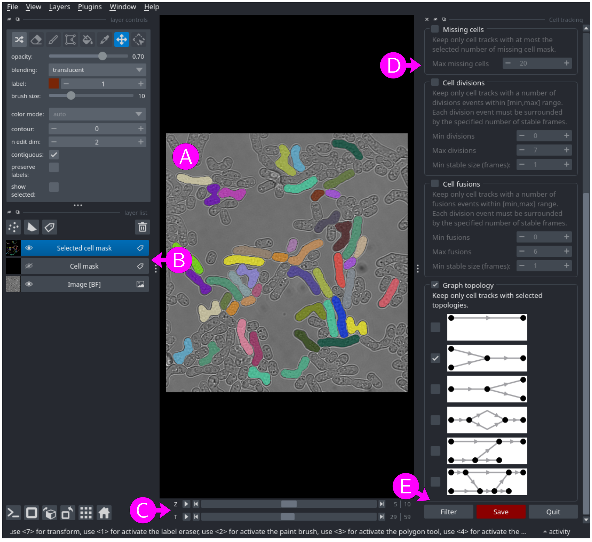

# Graph filtering module

The graph filtering module allows users to select a subset of cell tracks (connected components of the cell tracking graph) using various criteria and save the resulting filtered segmentation mask and cell tracking graph for further processing.

## Input files

A list of multi-dimensional segmentation masks with `X`, `Y` and `T` axes (see [File formats - images and masks](../general/files.md#images-and-masks) for more information) with corresponding cell tracking graphs (see [File formats - Cell tracking graphs](../general/files.md#cell-tracking-graphs) for more information).

Corresponding mask and graph files must be in the same folder. Their filenames must share the same basename and end with the suffixes specified below the table (by default `<basname>.ome.tif` and <basename>.graphmlz).

To populate the table, use the <kbd>Add file</kbd>, <kbd>Add folder</kbd> and <kbd>Remove selected</kbd> buttons to add masks or graphs, folder (all masks and graphs inside the folder) or remove rows from the list. Alternatively, masks, graphs and folders can be dragged and dropped from an external file manager. Masks (resp. graphs) without a corresponding graph (resp. mask) are ignored.

When adding files or folders, only files satisfying all filters (click on `▶` above the list to show filters) are added to the list. By default, only pairs of mask and graph with a filename containing `_vTG` (segmentation masks and cell tracking graphs generated with the cell tracking module) and ending with the suffixes specified below the table (`.ome.tif` and `.graphmlz`) are accepted.


## Parameters

Output folder
: Either use each input mask/graph folder as output folder or specify a
custom output folder. To select a custom folder, either paste the path
into the text box, click on the <kbd>Browse</kbd> button, or drag and drop a
folder from an external file manager. Be careful when using a custom folder: if
two input files share the same filename (from different folders), the
output for both files will be written to the same output file,
resulting in data corruption.

Output suffix
: The output filename will correspond to the input filename with an
additional `_vGF` suffix, optionally followed by a user defined suffix
(containing only `a-z`, `A-Z`, `0-9` and `-` characters). The
resulting output filenames are shown below the suffix.

Filters
: The output files will contain only cell tracks that satisfy all selected filters. For a description of the available filters, please refer to the descriptions in the GUI.

Multi-processing
: Number of processes to use for coarse-grain parallelization (memory
usage increases with the number of processes). This setting is only
useful if there are multiple input mask and graph, as each pair of input mask and graph will be
assigned to its own process.

Show (and edit) results in napari
: If checked, the resulting segmentation mask and cell tracking graph are shown in [napari](https://napari.org) for visual inspection and editing. This option is disabled if there is more than one pair of segmentation mask and cell tracking graph.

Input image
: Multi-dimensional image to display in napari together with segmentation mask (optional). This image should have at least `T`, `X`, and `Y` axes (with same size as the segmentation mask), and optionally `Z` and `C` axes (see [File formats - images and masks](../general/files.md#images-and-masks) for more information). To select an image, either paste the path into the text box, click on the <kbd>Browse</kbd> button, or drag and drop a file from an external file manager.


## Editing with napari

<figure>

<figcaption>Figure 1: napari window with a filtered segmentation mask overlaid on top of a bright-field image.</figcaption>
</figure>

If the "Show (and edit) results in napari" option is selected, the filtered mask is shown in [napari](https://napari.org), optionally overlaid on the image (Figure 1A). There is one layer per image channel (`C` axis), one layer for the original unfiltered segmentation mask (layer "Cell mask", hidden by default) and one layer for the filtered segmentation mask (layer "Selected cell mask", Figure 1B). Additionally, there is one slider for the time axis (`T`, Figure 1C) and one slider the `Z` axis if the image is present and has a `Z` axis (Figure 1C).

To filter cell tracks, check the chosen filters in the right panel (Figure 1D), then click on the <kbd>Filter</kbd> button (Figure 1E) to update the filtered segmentation mask (layer "Selected cell mask"). Note that filters are always applied to the original unfiltered segmentation mask.

Click on the <kbd>Save</kbd> (or <kbd>Filter & Save</kbd>) button to save the filtered segmentation mask and cell tracking graph.
Note that when showing and editing results in napari, the segmentation mask and cell tracking graph are not saved until clicking on the <kbd>Save</kbd> button.


## Output files

* Filtered segmentation mask (see [File formats - images and masks](../general/files.md#images-and-masks) for more information).
* Filtered Cell tracking graph (see [File formats - Cell tracking graphs](../general/files.md#cell-tracking-graphs) for more information).
* Log file (see [File formats - Log files and metadata](../general/files.md#log-files-and-metadata) for more information).

Output filenames are obtained by adding a `_vGF` suffix to the input filename, optionally followed by a user defined suffix. For example, with input segmentation mask and cell tracking graph
```
smp01_BF_vSM_vTG.ome.tif
smp01_BF_vSM_vTG.graphmlz
```
the output segmentation mask, cell tracking graph and log file will have filenames:
```
smp01_BF_vSM_vTG_vGF.ome.tif
smp01_BF_vSM_vTG_vGF.graphmlz
smp01_BF_vSM_vTG_vGF.log
```
