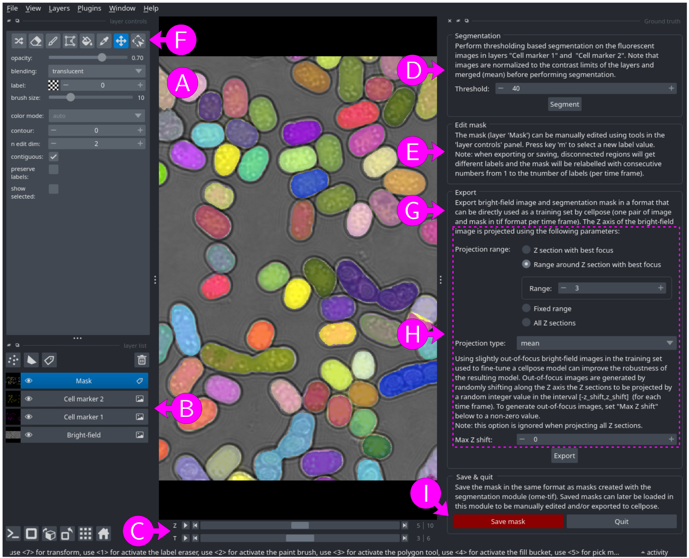

# Ground truth generator

Segmentation accuracy can be significantly improved by fine-tuning an existing model, rather than relying on a generalist model such as the built-in [Cellpose](https://www.cellpose.org/) cyto3 model.

This module allows users to prepare a ground truth segmentation mask for an image and export it in a format that can be directly used as a training set by [Cellpose](https://www.cellpose.org/) to fine-tune a segmentation model.


## Input files

Bright-field image
: A multi-dimensional bright-field image with at least `X` and `Y` axes, and optionally `Z` and `T` axes (see [File formats - images and masks](../general/files.md#images-and-masks) for more information).

Fluorescent image with cell marker 1
: A multi-dimensional fluorescent image of a cell marker with same dimension as the bright-field image (see [File formats - images and masks](../general/files.md#images-and-masks) for more information). This field is optional if a segmentation mask is specified.

Fluorescent image with cell marker 2
: A multi-dimensional fluorescent image of a cell marker with  with same dimension as the bright-field image (see [File formats - images and masks](../general/files.md#images-and-masks) for more information). This field is optional.

Segmentation mask
: A multi-dimensional segmentation mask at least `X` and `Y` axes, and optionally a `T` axis (see [File formats - images and masks](../general/files.md#images-and-masks) for more information). It must have same `X`, `Y` and `T` axes sizes as the bright-field image. This field is optional if a fluorescent image with cell marker is specified. Click on `▶` to show.


To select a file, either paste the path into the text box, click on the <kbd>Browse</kbd> button, or drag and drop a file from an external file manager.

When filling any of the input fields, other empty fields will be populated by a best guess (files in the same directory, assuming bright-field image filename ends with `_BF` and fluorescent images filenames end with `_WL<w>`, where `<w>` is the emission wavelength). Edit a field to erase the proposed files (e.g. type any character then erase it).


## Parameters

Output folder
: Either use input bright-field image folder as output folder or specify a
custom output folder. To select a custom folder, either paste the path
into the text box, click on the <kbd>Browse</kbd> button, or drag and drop a
folder from an external file manager.

Output suffix
: The output filename will correspond to the input filename with an
additional `_vGT` suffix, optionally followed by a user defined suffix
(containing only `a-z`, `A-Z`, `0-9` and `-` characters). The
resulting output filenames are shown below the suffix.


## Usage

<figure>

<figcaption>Figure 1: preparing ground truth annotations with napari.</figcaption>
</figure>


The bright-field image opens in a napari window (Figure 1A), together with the fluorescent images and segmentation mask (if specified), with one layer per input file (Figure 1B) and one slider per bright-field image axis (Figure 1C).

The general workflow is as follows:

Segmentation (Figure 1D)
: If at least one fluorescent image with cell marker is specified, a "Segmentation" section will be available in the right panel.
  Click on the <kbd>Segment</kbd> button to generate a segmentation mask using thresholding based segmentation on the fluorescent images. The resulting segmentation mask is stored in the layer "Mask" (any existing content in this layer will be overwritten). 
  Note that fluorescent images are first normalized to the contrast limits of their respective layers, then merged (mean value) before performing segmentation.

Edit mask (Figure 1E)
: The segmentation mask — whether obtained through thresholding based segmentation of fluorescent image(s) or by loading an existing segmentation mask — can be manually edited using the "Mask" layer drawing tools (Figure 1F). Be sure to check all time frames (`T` axis slider).

Export (Figure 1G)
: If the bright-field image does not include a `Z` axis, click on the <kbd>Export</kbd> button to export the bright-field image and segmentation mask in a format that can be directly used as a training set by Cellpose (i.e., one pair of 2D bright-field image and segmentation mask in `.tif` format per time frame).

    If the bright-field image includes a `Z` axis, additional parameters appear in the "Export" section (Figure 1H, dashed rectangle). The `Z` axis of the bright-field image will be projected using the selected range of Z-sections and projection type (see [Z-Projection module](../zprojection_module/reference.md) for more information). For best results, models fine-tuned with a specific Z projection settings should only be applied to images generated using the same Z projection settings.
    Note that a model fine-tuned on images obtained by projecting a range of Z-sections around the Z-section with best focus tends to be less sensitive to slightly out-of-focus images, compared to models fine-tuned using only one Z section with best focus.
    
    Additionally, incorporating slightly out-of-focus bright-field images into the training set can improve the robustness of the resulting model. To introduce such variability, set the "Max Z shift" parameter to a non-zero value. This will randomly shift the Z-section range by up to $\pm$"Max Z shift" before projection.

    Finally, click on the <kbd>Export</kbd> button to export the Z-projected (optionally randomly shifted) bright-field image and segmentation mask in a format that can be directly used as a training set by Cellpose (i.e., one pair of 2D bright-field image and segmentation mask in `.tif` format per time frame).

Save mask (Figure 1I)
: To save the edited segmentation mask in the same format as segmentation masks created with the segmentation module, click on the <kbd>Save mask</kbd> button. Saved segmentation masks can be later loaded in this module to be manually edited and exported as Cellpose training-set.


## Output files


If <kbd>Save mask</kbd> was clicked:
* Segmentation mask (see [File formats - images and masks](../general/files.md#images-and-masks) for more information).
* Log file (see [File formats - Log files and metadata](../general/files.md#log-files-and-metadata) for more information).

If <kbd>Export</kbd> was clicked:
* One pair of 2D  (`X` and `Y` axis) bright-field image and segmentation mask in TIFF tagged image format `.tif` per time frame in the input bright-field image.
* Log file (see [File formats - Log files and metadata](../general/files.md#log-files-and-metadata) for more information).


Output filenames are obtained by adding a `_vGT` suffix to the input bright-field image filename, optionally followed by a user defined suffix. For example, with input bright-field image
```
smp01_BF.nd2
```
the saved segmentation mask and log file will have filenames:
```
smp01_BF_vGT.ome.tif
smp01_BF_vGT.log
```

Exported files are saved in a folder with name obtained by adding a `_vGT` suffix to the input bright-field image filename, optionally followed by a user defined suffix and, if the bright-field image includes a `Z` axis, by a Z-projection suffix (see [Z-projection module - Output files](../zprojection_module/reference.md#output-files) for more information).
The filenames of exported images are obtained by taking the output directory name, followed by a `_vT<time frame>` suffix if the input image has multiple time frames. The segmentation mask has an additional `_masks` suffix.
For example, with input bright-field image
```
smp01_BF.nd2
```
and with mean projection over a range of 3 Z-sections around the Z-section with best focus, the export folder will be named:
```
smp01_BF_vGT_vPRb3mean/
```
If the input image includes a `T` axis, bright-field images be exported to
```
smp01_BF_vGT_vPRb3mean/smp01_BF_vGT_vPRb3mean_vT000.tif
smp01_BF_vGT_vPRb3mean/smp01_BF_vGT_vPRb3mean_vT001.tif
smp01_BF_vGT_vPRb3mean/smp01_BF_vGT_vPRb3mean_vT002.tif
smp01_BF_vGT_vPRb3mean/smp01_BF_vGT_vPRb3mean_vT003.tif
...
```
and segmentation masks to
```
smp01_BF_vGT_vPRb3mean/smp01_BF_vGT_vPRb3mean_vT000_masks.tif
smp01_BF_vGT_vPRb3mean/smp01_BF_vGT_vPRb3mean_vT001_masks.tif
smp01_BF_vGT_vPRb3mean/smp01_BF_vGT_vPRb3mean_vT002_masks.tif
smp01_BF_vGT_vPRb3mean/smp01_BF_vGT_vPRb3mean_vT003_masks.tif
...
```
and the log file will have filename
```
smp01_BF_vGT_vPRb3mean/smp01_BF_vGT_vPRb3mean.log
```

