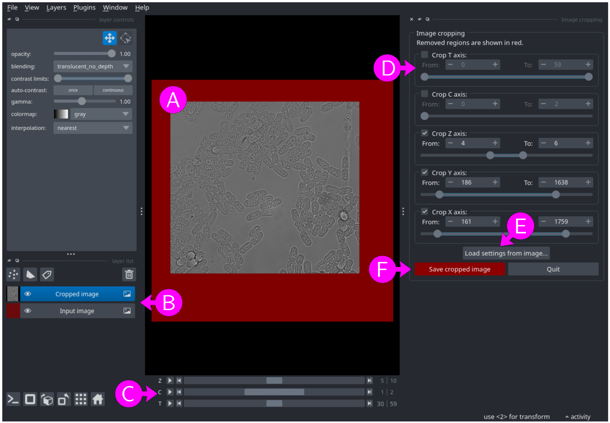

# Image cropping

With this module multi-dimensional images or segmentation mask can be cropped along any axis.

## Input files

A list of multi-dimensional images or masks with any combination of `X`, `Y`, `Z`, `C`, and `T` axes (see [File formats - images and masks](../general/files.md#images-and-masks) for more information).

To populate the list, use the <kbd>Add file</kbd>, <kbd>Add folder</kbd> and <kbd>Remove selected</kbd> buttons to add images or masks, folder (all images and masks inside the folder) or remove files from the list. Alternatively, files and folder can be dragged and dropped from an external file manager.

When adding files or folders, only files satisfying all filters (click on `▶` above the list to show filters) are added to the list.  By default, only files with a filename not containing `_vCR` (to avoid already cropped images), and ending with one of the accepted file extensions (`.nd2`, `.tif`, `.tiff`, `.ome.tif`, `.ome.tiff`) are accepted.


## Parameters

Output folder
: Either use each input images or mask folder as output folder or specify a
custom output folder. To select a custom folder, either paste the path
into the text box, click on the <kbd>Browse</kbd> button, or drag and drop a
folder from an external file manager. Be careful when using a custom folder: if
two input files share the same filename (from different folders), the
output for both files will be written to the same output file,
resulting in data corruption.

Output suffix
: The output filename will correspond to the input filename with an
additional `_vCR` suffix, optionally followed by a user defined suffix
(containing only `a-z`, `A-Z`, `0-9` and `-` characters). The
resulting output filenames are shown below the suffix.

Crop T axis
: If checked, crop `T` axis to the [From, To] range (0-based indexing). The cropping range is inclusive: when cropping from 2 to 10, all `T` axis indices 2, 3, ..., 10 are kept. 

From
: Minimum `T` axis index to keep. It will generate an error if larger than maximum `T` axis index.

To
: Maximum `T` axis index to keep. If larger than maximum `T` axis index, it will be set to the maximum `T` axis index.


Parameters for the other axes behave in the same way.


Load settings from an image...
: Click on the <kbd>Load settings from an image...</kbd> button to select a previously cropped image or mask, and set the cropping parameters using the information from its metadata.

Show (and edit) results in napari
: If checked, the resulting image or segmentation mask is shown in [napari](https://napari.org) where it can be interactively cropped. This option is disabled if there is more than one input segmentation mask.


## Interactive cropping with napari

<figure>

<figcaption>Figure 1: Interactive cropping with napari.</figcaption>
</figure>

If the "Show (and edit) results in napari" option is selected, the cropped image or mask is shown in [napari](https://napari.org). There is one layer for the cropped image, overlaid on top of the input image layer (Figure 1B). The input image layer is colored in red to highlight the cropped regions.

If the image includes a `T`, `C`, or `Z` axis, a separate slider is provided for each axis (Figure 1C). Note that, unlike in other modules, image channels (`C` axis) are controlled via a slider rather than being displayed as distinct layers.

To crop an axis, activate the corresponding checkbox and adjust the parameters using the "From" and "To" boxes or the range slider (Figure 1D).

Alternatively, click on the <kbd>Load settings from image...</kbd> button (Figure 1E) to select a previously cropped image or mask, and set the cropping parameters using the information from its metadata.

Notes:

* It is not possible to select a range of size one (e.g., `T` axis from 5 to 5) using the range slider; use the "From" and "To" boxes instead.
* The displayed image will be entirely red if any of the  `T`, `C`, or `Z` sliders are positioned outside of their cropping range (i.e., all displayed pixels will be removed from the cropped image). For example, is the `Z` axis slider (Figure 1C) is set to position 2 with a `Z` axis cropped from 4 to 6.

To save the cropped image or mask, click on the <kbd>Save cropped image</kbd> (Figure 1F).
Note that when showing and editing results in napari, the cropped image or mask is not saved until clicking on the <kbd>Save cropped image</kbd> button.


## Output files

* Cropped image or mask (see [File formats - images and masks](../general/files.md#images-and-masks) for more information).
* Log file (see [File formats - Log files and metadata](../general/files.md#log-files-and-metadata) for more information).

Output filenames are obtained by adding a `_vCR` suffix to the input filename, optionally followed by a user defined suffix. For example, with input image
```
smp01_BF.nd2
```
the output cropped image and log file will have filenames:
```
smp01_BF_vCR.ome.tif
smp01_BF_vCR.log
```
