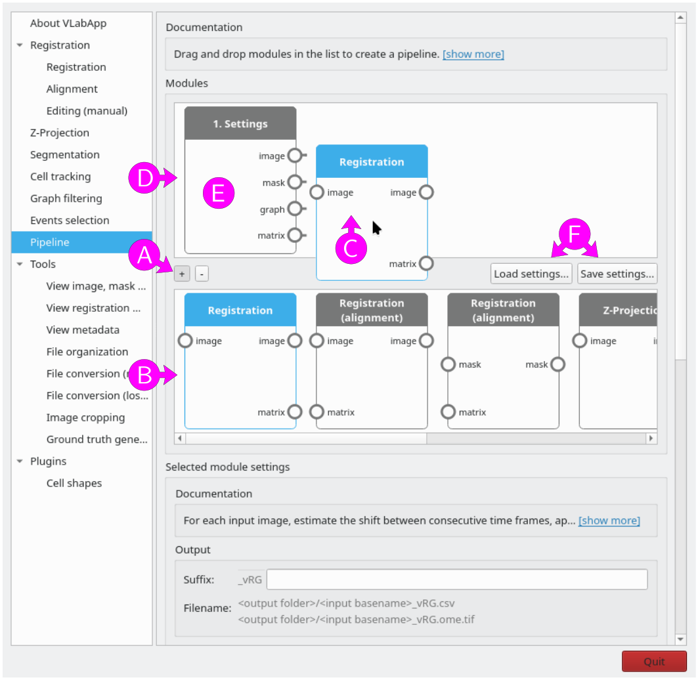
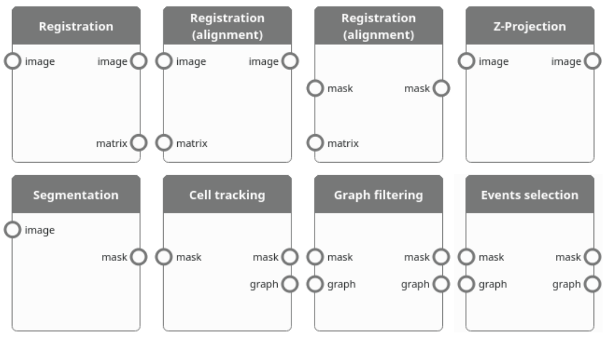

# Pipeline module

With the pipeline module, the main modules can be combined to create a linear pipeline. 

## Creating a pipeline

<figure>

<figcaption>Figure 1: Drag and drop modules to create a pipeline.</figcaption>
</figure>

To create a pipeline, click on the <kbd>+</kbd> button (Figure 1A) to open the list of available modules (Figure 1B), then drag and drop chosen modules (Figure 1C) to the pipeline's list of modules (Figure 1D).
Each module requires a specific set of input files types (annotated circles on the left) and generates a set of output files (annotated circles on the right).
When dropping a module, all its input file types must be available from the previous module's output file types. In addition, at most one registration module can be added to the module.
For example (Figure 2), the "Segmentation" module can be placed after the "Registration" module, the "Registration (alignment)" module (with image output) or the "Z-Projection" module all these modules generate an image file type which is required as input for the "Registration" module. However, the "Segmentation" module cannot be placed after "Registration (alignment)" module (with mask output), the "Segmentation" module, the "Cell tracking" module, the "Graph filtering" module or the "Events selection" module since none of these modules generate the required image file type.

<figure>

<figcaption>Figure 2: Available modules. Input and output file types are indicated with annotated circles on the left and right, respectively.</figcaption>
</figure>

## Parameters

Select a module to reveal its parameters below the list of modules. For a description of the available parameters, please see the corresponding module documentation.

To access general pipeline settings, select the "Setting" module (Figure 1E). Note that these setting will be applied to all modules in the pipeline. The following parameters will be available below the list of modules:

Input files
: List of input files. This option depends on the first module placed after the "Settings module". Please see the corresponding module documentation for more information.

Output folder
: Either use each input mask/graph folder as output folder or specify a
custom output folder. To select a custom folder, either paste the path
into the text box, click on the <kbd>Browse</kbd> button, or drag and drop a
folder from an external file manager. Be careful when using a custom folder: if
two input files share the same filename (from different folders), the
output for both files will be written to the same output file,
resulting in data corruption.

Use GPU
: Use a GPU if available. Currently, GPU can only be used in the Segmentation module. Using this option prevents from using CPU parallelization (both coarse grain or fine grain) for the Segmentation module, although coarse grain parallelization can still be used for other modules.

Number of processes
: Number of processes to use.

Use coarse grain parallelization
: If checked, each input file is assigned to its own process. Coarse grain parallelization should be used when there are more input files than processes and enough memory (memory usage increases with the number of processes). If neither this option nor the "Use GPU" option are selected, fine grained parallelization will be used for the Segmentation module. 

## Starting the pipeline

Click on the <kbd>Submit</kbd> button at the bottom of page to start the pipeline.
A progress dialog will open, showing the evolution of the computations.
To abort the pipeline, click on the <kbd>Abort</kbd> button. Note that this will cancel the remaining operations, but the currently running operations will continue until completion. 

## Saving and loading a pipeline

Use the <kbd>Load settings...</kbd> and <kbd>Save settings...</kbd> buttons (Figure 1F) to load or save all settings of the pipeline. 

