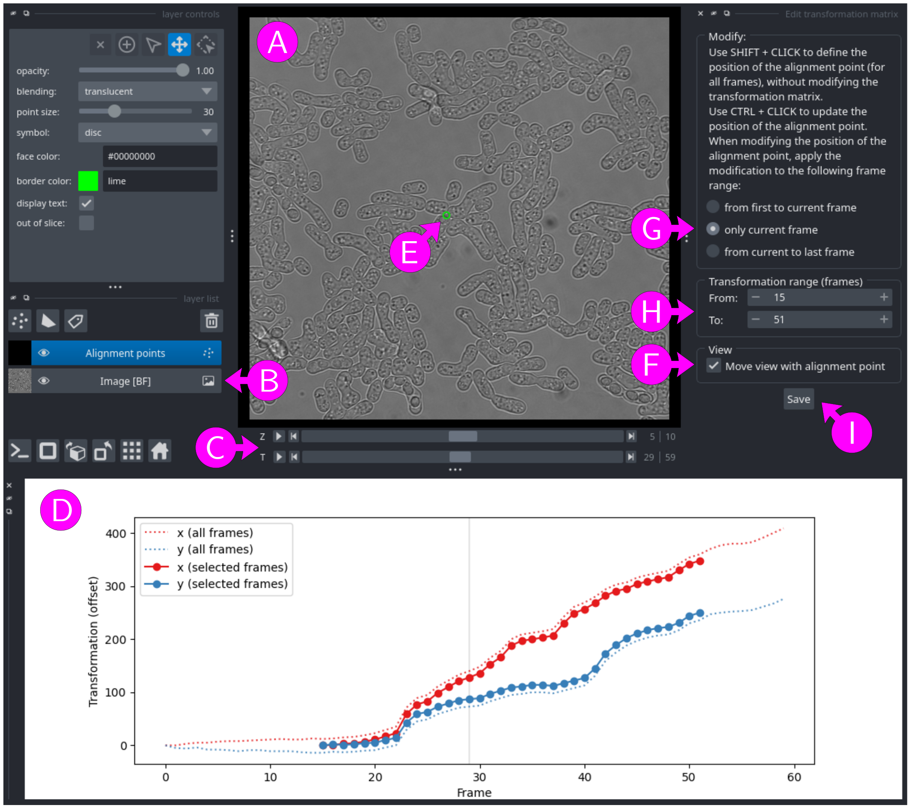

# Registration module

## Registration

The registration module estimates the shift between consecutive time frames. The resulting transformation matrix is applied to the input image to generate a registered image.

### Input files

A list of multi-dimensional images with at least `T`, `X`, and `Y` axes, and optionally `Z` and `C` axes (see [File formats - images and masks](../general/files.md#images-and-masks) for more information).

To populate the list, use the <kbd>Add file</kbd>, <kbd>Add folder</kbd> and <kbd>Remove selected</kbd> buttons to add images, folder (all images inside the folder) or remove images from the list. Alternatively, images and folder can be dragged and dropped from an external file manager.

When adding files or folders, only files satisfying all filters (click on `▶` above the list to show filters) are added to the list. By default, only files with a filename containing `_BF` (image with a unique bright-field channel), not containing `_vRG` (to avoid already registered images), and ending with one of the accepted file extensions (`.nd2`, `.tif`, `.tiff`, `.ome.tif`, `.ome.tiff`) are accepted.


### Parameters

Output folder
: Either use each input image folder as output folder or specify a
custom output folder. To select a custom folder, either paste the path
into the text box, click on the <kbd>Browse</kbd> button, or drag and drop a
folder from an external file manager. Be careful when using a custom folder: if
two input files share the same filename (from different folders), the
output for both files will be written to the same output files,
resulting in data corruption.

Output suffix
: The output filename will correspond to the input filename with an
additional `_vRG` suffix, optionally followed by a user defined suffix
(containing only `a-z`, `A-Z`, `0-9` and `-` characters). The
resulting output filenames are shown below the suffix.

Channel position
: If the input image contains more than one channel (`C` axis), the
channel with index specified in `channel position` will be used for
registration (0-based indexing). Note that the selected channel is
only used to evaluate the transformation matrix, the output image
will contain the same channels as the input image.

Projection range and type
: Registration methods implemented in VLabApp cannot deal with
multiple Z sections. If the input image contains a `Z` axis with
multiple Z sections, the chosen range of Z sections will be projected
using the chosen projection type (see [Z-Projection
module](../zprojection_module/reference.md) for more information). For
bright-field images, preliminary results suggest that the `std`
projection type gives the best results.  Note that the Z-projected
image is only used to evaluate the transformation matrix, the output
image will contain the same Z-sections as the input image.

Time point range
: The transformation matrix can be applied to all time frames, or only
to a selected range of time frames. All time frames outside of the
selected range are ignored when evaluating the transformation
matrix. In addition, registered images obtained by applying this
transformation matrix contains only the selected time frames. This option can
be useful if the total shift over time is too large, resulting in a
very small or empty registered image after cropping to common region shared by all time frames
in the image. It can also be used to ignore bad quality time
frames. As an alternative, it is possible to use the image cropping
module to crop the image before using the registration module.

Registration method
: The following registration method are available (see [Appendix: Registration methods](#appendix-registration-methods) for more information):
    
    * StackReg by Philippe Thevenaz/EPFL [1] ([https://bigwww.epfl.ch/thevenaz/stackreg/](https://bigwww.epfl.ch/thevenaz/stackreg/)).
    * Phase correlation. This method is fast, but tend to fail when too many non-moving artefacts are present in the image (e.g. dust).
    * Feature matching using ORB, BRISK, AKAZE or SIFT algorithms. Preliminary tests on few sample images suggest that registration using  ORB, BRISK, AKAZE or SIFT algorithms give results of similar quality. However, computation time varies significantly. From fastest to slowest: ORB, BRISK, AKAZE, SIFT.

Co-align files with the same unique identifier
: If checked, all images in the same folder as the input image with
same unique identifier (the part of the filename before the first `_`)
and whose filename does not contain `_vRG` (i.e. not yet registered)
will also be transformed using the transformation matrix. This
option should not be used if multiple files in the list of input
images share the same unique identifier (e.g. `smp01_BF.nd2` and
`smp01_WL614.nd`), as this will result in data corruption.

Do not crop aligned image
: By default, `X` and `Y` axes of the registered images are cropped to
the common region shared by all time frames. If the "Do NOT crop
aligned image" option is checked, the registered image is not
cropped. The resulting image has the same dimensions as the input
image, and any regions that move outside of the image border are
wrapped around using periodic boundary conditions on the `X` and `Y`
axes.

Multi-processing
: Number of processes to use for coarse-grain parallelization (memory
usage increases with the number of processes). This setting is only
useful if there are multiple input images, as each input image will be
assigned to its own process.


### Output files

* Transformation matrix (see [File formats - Transformation matrices](../general/files.md#transformation-matrices-registration) for more information).
* Registered image (see [File formats - images and masks](../general/files.md#images-and-masks) for more information).
* Log file (see [File formats - Log files and metadata](../general/files.md#log-files-and-metadata) for more information).

Output filenames are obtained by adding a `_vRG` suffix to the input filename, optionally followed by a user defined suffix. For example, with input image
```
smp01_BF.nd2
```
the output transformation matrix, registered image and log file will have filenames:
```
smp01_BF_vRG.csv
smp01_BF_vRG.ome.tif
smp01_BF_vRG.log
```


## Alignment

This module apply existing transformation matrices (created with the registration module) to input images to generate registered images.

### Input files

A list of multi-dimensional images with at least `T`, `X`, and `Y` axes, and optionally `Z` and `C` axes and corresponding transformation matrices (see [File formats - images and masks](../general/files.md#images-and-masks) and [File formats - Transformation matrices](../general/files.md#transformation-matrices-registration) for more information).

To populate the list, use the <kbd>Add file</kbd>, <kbd>Add folder</kbd> and <kbd>Remove selected</kbd> buttons to add images, folder (all images inside the folder) or remove files from the list. Alternatively, images and folder can be dragged and dropped from an external file manager.
When adding files or folders, only files satisfying all filters (click on `▶` above the list to show filters) are added to the list. By default, only files with a filename not containing `_vRG` (to avoid already registered images), and ending with one of the accepted file extensions (`.nd2`, `.tif`, `.tiff`, `.ome.tif`, `.ome.tiff`) are accepted.

For each image, a corresponding transformation matrix file must be in the same folder as the image, and the image and matrix filenames must share the same unique identifier (part of the filename before the first `_`). If multiple matrix files correspond to an image, the matrix with shortest filename will be selected.


### Parameters

Output folder
: Either use each input image folder as output folder or specify a
custom output folder. To select a custom folder, either paste the path
into the text box, click on the <kbd>Browse</kbd> button, or drag and drop a
folder from an external file manager. Be careful when using a custom folder: if
two input files share the same filename (from different folders), the
output for both files will be written to the same output file,
resulting in data corruption.

Output suffix
: The output filename will correspond to the input filename with an
additional `_vRG` suffix, optionally followed by a user defined suffix
(containing only `a-z`, `A-Z`, `0-9` and `-` characters). The
resulting output filenames are shown below the suffix.

Do not crop aligned image
: By default, `X` and `Y` axes of the registered images are cropped to
the common region shared by all time frames. If the "Do NOT crop
aligned image" option is checked, the registered image is not
cropped. The resulting image has the same dimensions as the input
image, and any regions that move outside of the image border are
wrapped around using periodic boundary conditions on the `X` and `Y`
axes.

Multi-processing
: Number of processes to use for coarse-grain parallelization (memory
usage increases with the number of processes). This setting is only
useful if there are multiple input images, as each input image will be
assigned to its own process.


### Output files

* Registered image (see [File formats - images and masks](../general/files.md#images-and-masks) for more information).
* Log file (see [File formats - Log files and metadata](../general/files.md#log-files-and-metadata) for more information).

Output filenames are obtained by adding a `_vRG` suffix to the input filename, optionally followed by a user defined suffix. For example, with input image
```
smp01_BF.nd2
```
the output registered image and log file will have filenames:
```
smp01_BF_vRG.ome.tif
smp01_BF_vRG.log
```


## Editing (batch)

This module allows users to edit the time point range (the range of time frames to use for the transformation) of existing transformation matrices. Note that transformation matrices files are modified in place.

### Input files

A list of transformation matrices (see [File formats - Transformation matrices](../general/files.md#transformation-matrices-registration) for more information).

To populate the list, use the <kbd>Add file</kbd>, <kbd>Add folder</kbd> and <kbd>Remove selected</kbd> buttons to add transformation matrices, folder (all transformation matrices inside the folder) or remove transformation matrices from the list. Alternatively, files and folder can be dragged and dropped from an external file manager.

When adding files or folders, only files satisfying all filters (click on `▶` above the list to show filters) are added to the list. By default, only files with a filename containing `_vRG` (output of the registration module), and ending with one of the accepted file extensions (`.txt`, `.csv`) are accepted.


### Parameters

New time point range
: Range of time frames to apply the transformation matrix. All time frames outside of the
selected range are ignored when evaluating the transformation
matrix. In addition, registered images obtained by applying this
transformation matrix contains only the selected time frames. This option can
be useful if the total shift over time is too large, resulting in a
very small or empty registered image after cropping to common region shared by all time frames
in the image. It can also be used to ignore bad quality time
frames. As an alternative, it is possible to use the image cropping
module to crop the image before using the registration module.

Multi-processing
: Number of processes to use for coarse-grain parallelization (memory
usage increases with the number of processes). This setting is only
useful if there are multiple input images, as each input image will be
assigned to its own process.


### Output files

* Transformation matrix (see [File formats - Transformation matrices](../general/files.md#transformation-matrices-registration) for more information).
* Log file (see [File formats - Log files and metadata](../general/files.md#log-files-and-metadata) for more information).

Modification are done in place (the original input matrix and log file are overwritten)


## Editing (manual)

This module allows users to edit an existing transformation matrix using [napari](https://napari.org).  Note that the transformation matrix is modified in place.

### Input files

* A transformation matrix (see [File formats - Transformation matrices](../general/files.md#transformation-matrices-registration) for more information)
* A multi-dimensional image with at least `T`, `X`, and `Y` axes, and optionally `Z` and `C` axes (see [File formats - images and masks](../general/files.md#images-and-masks) for more information). Important: this image should not be registered. Ideally, the image used to create the transformation matrix should be selected here. 

To select a transformation matrix or an image, either paste the path into the text box, click on the <kbd>Browse</kbd> button, or drag and drop a file from an external file manager.

Note that when filling the image or the transformation matrix field while the other field is empty, the empty field is populated by a best guess.


### Usage

<figure>

<figcaption>Figure 1: Manually editing a registration matrix with napari</figcaption>
</figure>

The unregistered image opens in [napari](https://napari.org) (Figure 1A), with one layer per channel (`C` axis, Figure 1B), one slider for the time axis (`T`, Figure 1C) and one slider the `Z` axis if the image has a `Z` axis  (Figure 1C).

A graphical representation of the transformation matrix is shown in the lower part of the window (Figure 1D), with x (red) and y (blue) coordinates of the image offset (vertical axis) as a function of time (horizontal axis). The full transformation matrix evaluated for all time frames is shown with dashed lines and the final transformation matrix, limited to a selected range of time frames, is shown with plain lines and points.

The transformation matrix is also represented by a green control point (Figure 1E) overlaid on the image (layer "Alignment points"). The position of the control point is transformed using the transformation matrix (i.e. it should ideally follow the cells in the image). By default, when changing the time frame (using the `T` slider), the view follow the control point, which seems to have a fixed position. To keep the image at fixed position, uncheck the "Move view with alignment point" option (Figure 1F).

By default, the control point is placed at the center of the image. However, it might be better to place it at a more remarkable position (e.g. at the center of a cell). To globally move the control point for all time frames (without changing the transformation matrix), click at the desired position while pressing the <kbd>SHIFT</kbd> key (make sure that the layer "Alignment points" is selected, Figure 1B).

The transformation matrix is modified by adjusting the position of the control point at the current time frame (selected with the Z slider), from first to current time frame, or from current time frame to last (the desired behavior can be selected in the right part of the window, Figure 1G). To move the control point for the selected range of frame, click at the desired position while pressing the <kbd>CTRL</kbd> key (or <kbd>CMD</kbd> key with Mac OS X).

The range of time frames to use for the transformation can be set using the "From" and "To" fields in the right part of the window (Figure 1H).

To save the transformation matrix, click on the <kbd>Save</kbd> button (Figure 1I).
Note that with this module, the transformation matrix file is only modified when clicking on the <kbd>Save</kbd> button.


### Output files

* Transformation matrix (see [File formats - Transformation matrices](../general/files.md#transformation-matrices-registration) for more information).
* Log file (see [File formats - Log files and metadata](../general/files.md#log-files-and-metadata) for more information).

Modification are done in place (the original input matrix and log file are overwritten when clicking on the <kbd>Save</kbd> button)


## Appendix: Registration methods

The following registration methods are implemented:

* **StackReg**: Registration using [pyStackReg](https://github.com/glichtner/pystackreg) with translation transformation. [pyStackReg](https://github.com/glichtner/pystackreg) is a Python/C++ port of the ImageJ extension [TurboReg/StackReg](http://bigwww.epfl.ch/thevenaz/turboreg/) written by Philippe Thevenaz/EPFL [1].

* **Phase correlation**: Registration using the phase correlation method implemented in [OpenCV](https://opencv.org/) (function `phaseCorrelate()`), which uses the Fourrier shift theorem to detect translational shift in the frequency domain (see [https://en.wikipedia.org/wiki/Phase_correlation](https://en.wikipedia.org/wiki/Phase_correlation)). This method is fast, but tend to fail when too many non-moving artefacts are present in the image (e.g. dust).

* **Feature matching**: Four variants of the "feature matching" registration methods are available (ORB, BRISK, AKAZE and SIFT). In this method, registration is performed in three steps:

    1. Feature (keypoints) detection and evaluation of the descriptors using methods implemented in [OpenCV](https://opencv.org/). Four keypoints detector an descriptor extractor algorithms are available:
  
        * ORB (Oriented FAST and Rotated BRIEF) [2].
        * BRISK (Binary Robust invariant scalable keypoints) [3].
        * AKAZE (Accelerated-KAZE) [4].
        * SIFT (scale-invariant feature transform) [5].
    
    2. Feature matching. Features found in consecutive image frames are matched using the FLANN-based descriptor matcher implemented in  [OpenCV](https://opencv.org/)  (FLANN stands for Fast Library for Approximate Nearest Neighbors). Matches are further filtered using the distance ratio test proposed by Lowe [5] (with threshold 0.75).
  
    3. Parameter estimation using RANSAC. The shift between consecutive image frames is then estimated with the Random sample consensus (RANSAC) method implemented in [scikit-image](https://scikit-image.org/) using a custom transformation model with translation only.
  
    Preliminary tests on few sample images suggest that registration using  ORB, BRISK, AKAZE or SIFT algorithms give results of similar quality.
    Note that the scale and rotational invariance is not so important when considering consecutive image frames, as the size and orientation of the features is not expected to change on short time scale.
    However, computation time varies significantly. From fastest to slowest: ORB, BRISK, AKAZE, SIFT.


### References

[1] P. Thevenaz, U. E. Ruttimann and M. Unser (1998). A pyramid approach to subpixel registration based on intensity. IEEE Transactions on Image Processing, 7(1), 27–41.

[2] E. Rublee, V. Rabaud, K. Konolige and G. Bradski (2011). ORB: An efficient alternative to SIFT or SURF. Procedings of the IEEE International Conference on Computer Vision, 2564–2571.

[3] S. Leutenegger, M. Chli and R. Y. Siegwart (2011). Brisk: Binary robust invariant scalable keypoints.  Procedings of the IEEE International Conference on Computer Vision, 2548–2555.

[4] P. F. Alcantarilla, J. Nuevo and A. Bartoli (2013). Fast explicit diffusion for accelerated features in nonlinear scale spaces.  Procedings of the British Machine Vision Conference 2013, 13.1-13.11.

[5] D. G. Lowe (2004). Distinctive Image Features from Scale-Invariant Keypoints. International Journal of Computer Vision, 60(2), 91–110.

