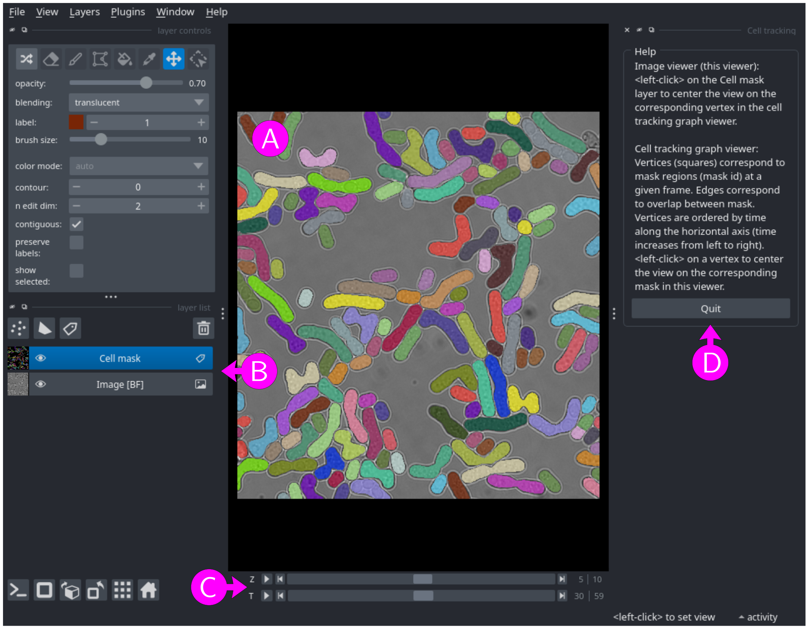
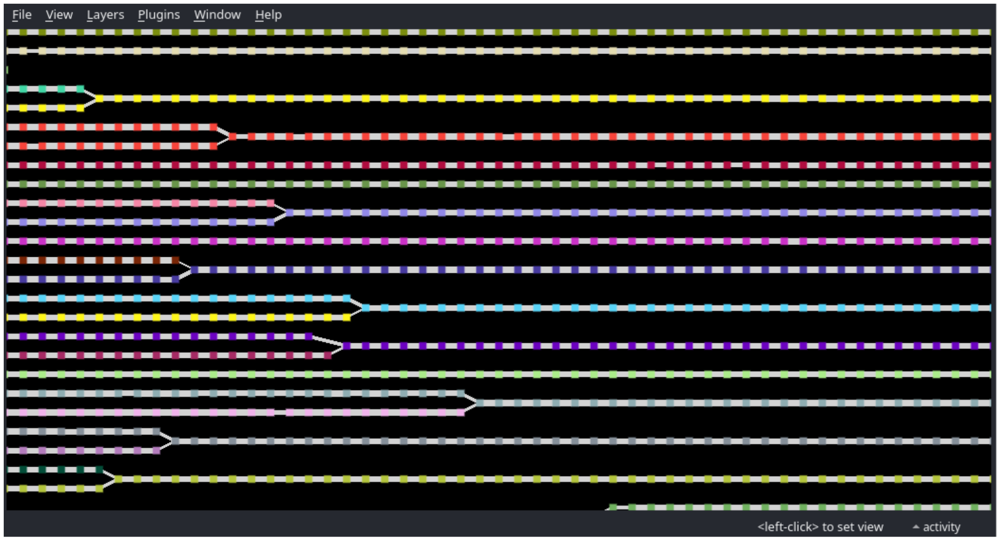

# View image, mask and graph

This module allows users to view an image, a segmentation mask and/or a cell tracking graph using [napari](https://napari.org).

## Input files

Image
: A multi-dimensional image with at least `X` and `Y` axes, and optionally `C`, `Z` and `T` axes (see [File formats - images and masks](../general/files.md#images-and-masks) for more information). This field is optional. 

Segmentation mask
: A multi-dimensional segmentation mask with at least `X` and `Y` axes, and optionally `Z` and `T` axes (see [File formats - images and masks](../general/files.md#images-and-masks) for more information). This field is optional, but must be filled if a cell tracking graph is specified.

Cell tracking graph
: A cell tracking graph (see [File formats - Cell tracking graphs](../general/files.md#cell-tracking-graphs) for more information). This field is optional. Note that a cell tracking graph cannot be viewed without the corresponding segmentation mask.

To select a file, either paste the path into the text box, click on the <kbd>Browse</kbd> button, or drag and drop a file from an external file manager.

When filling the segmentation mask or cell tracking graph field, VLabApp try to fill the other empty fields by searching for corresponding files in the same directory. Edit a field to erase the proposed files (e.g. type any character then erase it).

## Usage

<figure>

<figcaption>Figure 1: napari window with a segmentation mask overlaid on top of a bright-field image.</figcaption>
</figure>

<figure>

<figcaption>Figure 2: napari window with the cell tracking graph associated with the segmentation mask shown in Figure 1.</figcaption>
</figure>

If specified, the image and segmentation mask open in one napari window (Figure 1A), with one layer per image channel (`C` axis) and one layer for the segmentation mask (Figure 1B). If the image or the mask has a `T` (time) or a `Z` axis, corresponding sliders will be available at the bottom of the window (Figure 1C).
If specified, the cell track graph opens in a second napari window (Figure 2)..

Both windows support panning and zooming with a mouse or touchpad. Selecting a specific `T` or `Z` axis position can be done using the respective axis slider.

For the following, make sure that the "Cell mask" layer is selected (Figure 1B). When hovering over a labelled region in the segmentation mask, the corresponding mask id is shown in the status bar. Similarly, when hovering over a vertex in the cell tracking graph, the corresponding time frame and mask id are shown in the status bar. Click (left mouse button) on a labelled region in the segmentation mask to center the view on the corresponding vertex in the cell tracking graph view.
Click (left mouse button) on a vertex of the cell tracking graph to center the segmentation mask view on the corresponding labelled region and time frame (`T` axis slider).

Warning: when viewing a cell tracking graph (two napari windows), use the <kbd>Quit</kbd> button to close napari windows (Figure 1D).
Do not use the "Close window" option in the "File" menu nor the window close button , as it may crash the application. Do not use "Exit" option in the "File" menu, as it will close the full VLabApp application.

