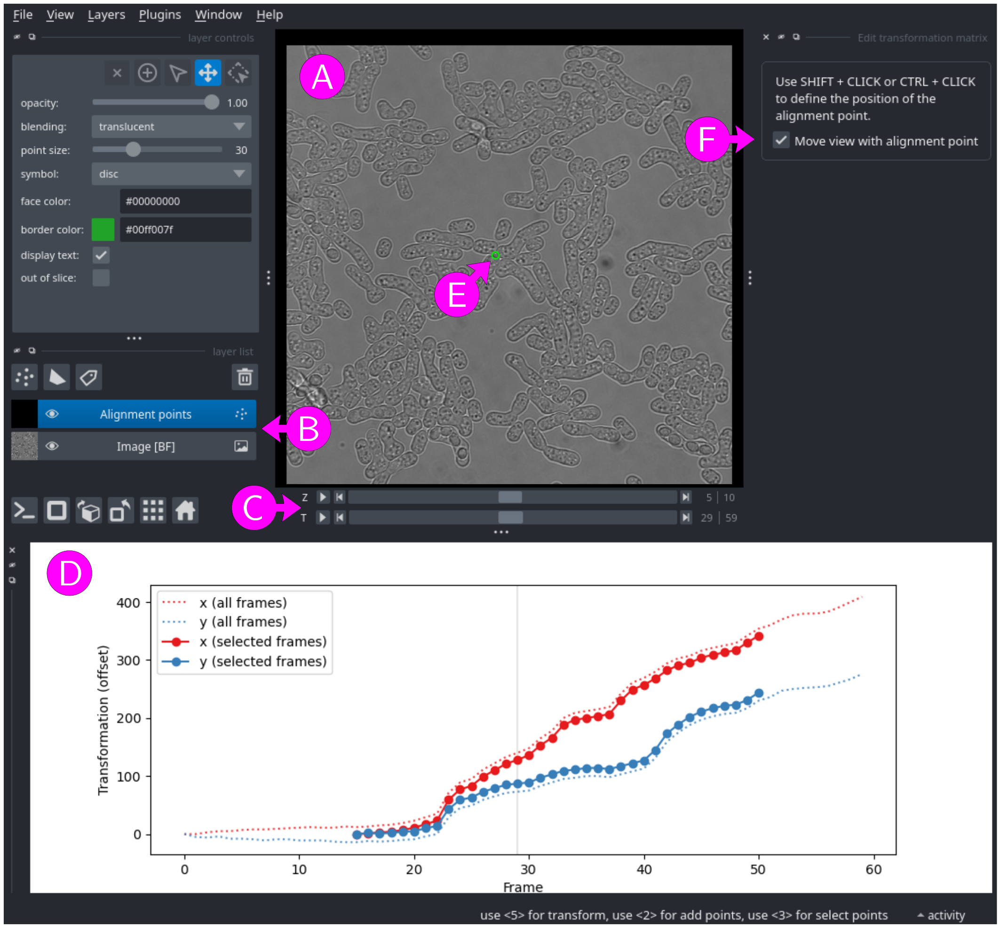

# View registration matrix

This module allows users to view a transformation matrix using [napari](https://napari.org).

### Input files

Image (before registration)
: A multi-dimensional image with at least `T`, `X`, and `Y` axes, and optionally `Z` and `C` axes (see [File formats - images and masks](../general/files.md#images-and-masks) for more information). Important: this image should not be registered. Ideally, the image used to create the transformation matrix should be selected here.

Registration matrix
: A transformation matrix (see [File formats - Transformation matrices](../general/files.md#transformation-matrices-registration) for more information)

To select a file, either paste the path into the text box, click on the <kbd>Browse</kbd> button, or drag and drop a file from an external file manager.

Note that when filling the image or the transformation matrix field while the other field is empty, the empty field is populated by a best guess.  Edit a field to erase the proposed files (e.g. type any character then erase it).

## Usage

<figure>

<figcaption>Figure 1: Viewing a registration matrix with napari</figcaption>
</figure>

The unregistered image opens in [napari](https://napari.org) (Figure 1A), with one layer per channel (`C` axis, Figure 1B), one slider for the time axis (`T`, Figure 1C) and one slider the `Z` axis if the image has a `Z` axis  (Figure 1C).

A graphical representation of the transformation matrix is shown in the lower part of the window (Figure 1D), with x (red) and y (blue) coordinates of the image offset (vertical axis) as a function of time (horizontal axis). The full transformation matrix evaluated for all time frames is shown with dashed lines and the final transformation matrix, limited to a selected range of time frames, is shown with plain lines and points.

The transformation matrix is also represented by a green control point (Figure 1E) overlaid on the image (layer "Alignment points"). The position of the control point is transformed using the transformation matrix (i.e. it should ideally follow the cells in the image). By default, when changing the time frame (using the `T` slider), the view follow the control point, which seems to have a fixed position. To keep the image at fixed position, uncheck the "Move view with alignment point" option (Figure 1F).

By default, the control point is placed at the center of the image. However, it might be better to place it at a more remarkable position (e.g. at the center of a cell). To  move the control point for all time frames, click at the desired position while pressing the <kbd>SHIFT</kbd> key (make sure that the layer "Alignment points" is selected, Figure 1B).

