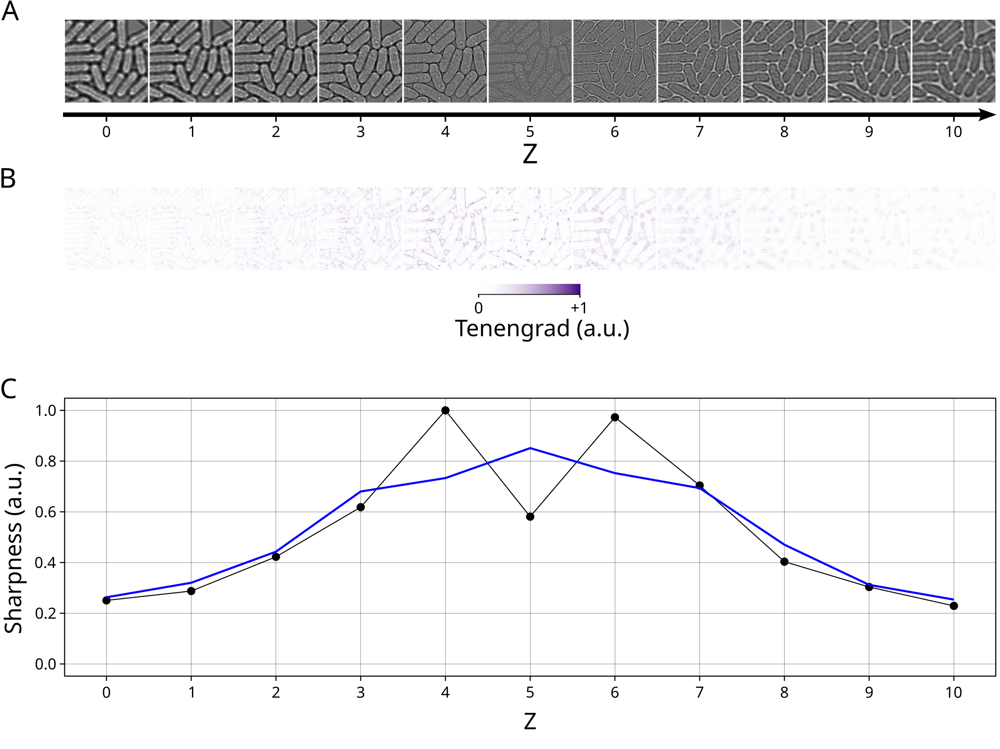
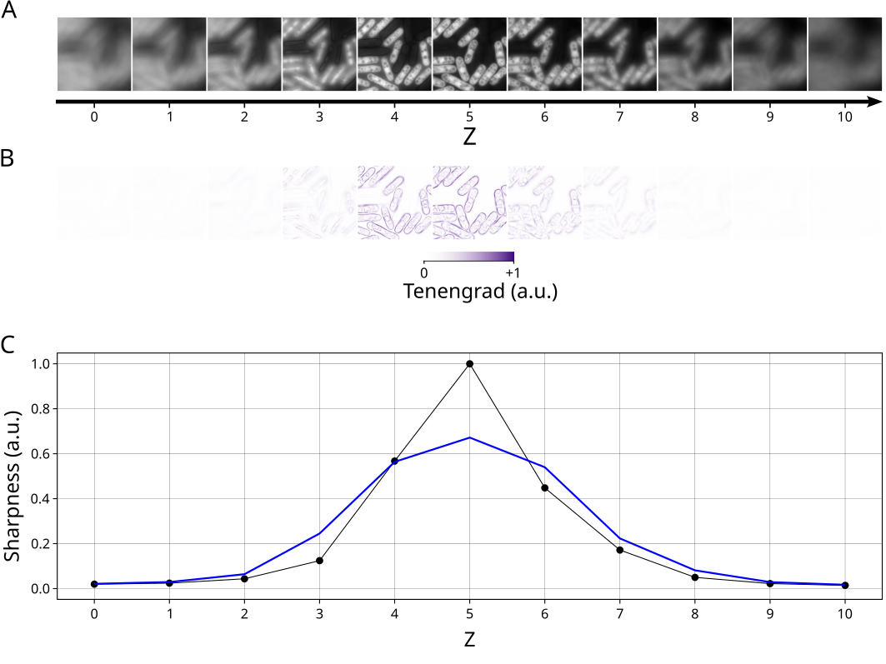

# Z-Projection module

The Z-Projection module performs a Z-stack projection of an image.

## Input files

A list of multi-dimensional images with at least `X`, `Y`, and `Z` axes, and optionally `C` and `T` axes (see [File formats - images and masks](../general/files.md#images-and-masks) for more information).

To populate the list, use the <kbd>Add file</kbd>, <kbd>Add folder</kbd> and <kbd>Remove selected</kbd> buttons to add images, folder (all images inside the folder) or remove images from the list. Alternatively, images and folder can be dragged and dropped from an external file manager.

When adding files or folders, only files satisfying all filters (click on `▶` above the list to show filters) are added to the list. By default, only files ending with one of the accepted file extensions (`.nd2`, `.tif`, `.tiff`, `.ome.tif`, `.ome.tiff`) are accepted.


## Parameters

Output folder
: Either use each input image folder as output folder or specify a
custom output folder. To select a custom folder, either paste the path
into the text box, click on the <kbd>Browse</kbd> button, or drag and drop a
folder from an external file manager. Be careful when using a custom folder: if
two input files share the same filename (from different folders), the
output for both files will be written to the same output file,
resulting in data corruption.

Output suffix
: The output filename will correspond to the input filename with an
additional `_vPR<ref><range><proj>`, where `<ref>` is the reference Z-section (`b` for best focus or `f` for fixed range), `<range>` is the range of Z-sections (one integer for range around Z-section with best focus or two integers  min and max separated by a `-` for fixed Z-section range) and `<proj>` is the projection type (`none`, `max`, `min`, `mean`, `median` or `std`).  The resulting output filenames are shown below the suffix. It is not possible to set a user defined suffix in this module.

Projection range
: Range of Z sections to project.

    * Z-section with best focus: select only the Z-section with best focus.
    * Range around Z-section with best focus: select all Z sections with $Z$ in the interval $[Z_{best}-r,Z_{best}+r]$, where $Z_{best}$ is the Z section with best focus and $r$ is the range.
    * Fixed range from $Z_{min}$ to $Z_{max}$: select all Z-sections with $Z_{min}\leq Z \leq Z_{max}$.
    * All Z-sections: select all Z-sections.
  
    The selected Z-sections are then projected using the chosen projection type (see [Appendix: Z-Projection methods](#appendix-z-projection-methods) for more information).

Projection type
: summary statistics to use when projecting the selected Z-sections (`max`, `min`, `mean`, `median` or `std`). See [Appendix: Z-Projection methods](#appendix-z-projection-methods) for more information.


Multi-processing
: Number of processes to use for coarse-grain parallelization (memory
usage increases with the number of processes). This setting is only
useful if there are multiple input images, as each input image will be
assigned to its own process.


## Output files

* Z-projected image (see [File formats - images and masks](../general/files.md#images-and-masks) for more information).
* Log file (see [File formats - Log files and metadata](../general/files.md#log-files-and-metadata) for more information).

Output filenames are obtained by adding a `_vPR<ref><range><proj>` suffix to the input filename. For example, with input image
```
smp01_BF.nd2
```
and a mean projection over the fixed range from 3 to 7, the output Z-projected image and log file will have filenames:
```
smp01_BF_vPRf3-7mean.ome.tif
smp01_BF_vPRf3-7mean.log
```


## Appendix: Z-Projection methods

### Z-Projection

We consider the problem of reducing a Z-stack of 2D images to a unique 2D image (Z-projection).

The value $v(x,y)$ of the pixel at position $(x,y)$ in the new image is obtained by summarizing the values of the pixels at the same position over all Z sections (or a subset of Z sections) using a given summary statistics (e.g. mean, median, max,...).

The subset of Z sections used for projection can be:

* all Z sections.
* a fixed range of Z sections.
* a range of Z sections around the Z section with best focus.
* only the Z section with best focus.


#### All Z sections

All Z sections are used for the projection.


#### Fixed range of Z sections

The subset of Z sections used for projection is chosen as all Z sections within the fixed interval $Z\in[Z_\text{min},Z_\text{max}]$, with user-defined $Z_\text{min}$ and $Z_\text{max}$.

Note:

* $Z_\text{min}$ and $Z_\text{max}$ are called "From" and "To" in the GUI.


#### Range of Z sections around the Z section with best focus.

The subset of Z sections used for projection is chosen as all Z sections within a user specified window around the Z section with best focus. I.e. Z sections with $Z\in \{Z_\text{best}-\Delta_Z,Z_\text{best}-\Delta_Z +1,\cdots,Z_\text{best}+\Delta_Z\}$, where $Z_\text{best}$ corresponds to the Z-section with best focus and $\Delta_Z$ is the size of the Z window.

If $Z_\text{best}$ and $\Delta_Z$ are such that some values in $\{Z_\text{best}-\Delta_Z,Z_\text{best}-\Delta_Z +1,\cdots,Z_\text{best}+\Delta_Z\}$ are outside the range of Z sections existing in the image, then the set is shifted towards valid values of Z.
E.g. a Z-stack with 11 sections (Z=0, 1, ..., 10), $\Delta_Z=3$ and $Z_\text{best}=1$: The set of Z sections to be used for projection is $\{-2,-1,0,1,2,3,4\}$, which contains invalid values (-2 and -1). It is thus shifted in the positive Z direction to avoid negative values $\{0,1,2,3,4,5,6\}$ 

To estimate $Z_\text{best}$ (see Figure 1 and 2), the tenengrad

$$T(x,y) = \sqrt{\left(\frac{\partial v(x,y)}{\partial x}\right)^2 + \left(\frac{\partial v(x,y)}{\partial y}\right)^2}$$

of each Z section is estimated using Sobel operators of size 3x3. The tenengrad can be interpreted as a measure of the local slope. In particular, it is large for region of the image with sharp variations (such as edges) and zero for regions with constant pixel intensities.


The "sharpness" is then estimated, for each Z, as the variance of the tenengrad of the corresponding Z section (Figure 1C and 2C).
The sharpness is then smoothed using a running mean with window of size 3.
Finally, $Z_\text{best}$ is obtained as the $Z$ at which the smoothed sharpness reaches its maximum.


<figure>

<figcaption>Figure 1: determination of Z section with best focus. Panel A: Z sections of a bright-field image. Panel B: Tenengrad of the Z sections. Panel C: Sharpness of each Z section (black points) as a function of Z together with the smoothed sharpness (blue).</figcaption>
</figure>


<figure>

<figcaption>Figure 2: same as Figure 1 but with a fluorescence image.</figcaption>
</figure>

Note:

* The window size $\Delta_Z$ is called "Projection range" in the GUI.


#### Z section with best focus

The stack of Z sections is simply replaced by the Z section with best focus (obtained as described above).


