# Methods

**Author:** Julien Dorier, Bioinformatics Competence Center, University of Lausanne, 1015 Lausanne, Switzerland 

## Cell tracking

### Terminology:

Terminology is illustrated in Figure 1:

* **Image**: original input image (e.g. bright-field image after Z-projection), below we assume it has axes T (time), Y, X and a unique channel (bright-field).
* **Mask**: an image with same dimension as the input image and a unique channel (segmented object label). Masks are usually generated by a segmentation algorithm (e.g. cellpose), but can also be created manually.
* **Labels**: An integer ID assigned to each segmented object (in this document, labels are represented by colors).
* **labelled region**: sets of pixels assigned to a specific label (at a specific time frame).

<figure>
  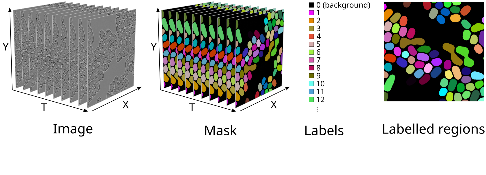
  <figcaption>Figure 1: Terminology.</figcaption>
</figure>

### Cell tracking graph: creation

The cell tracking graph is created by assigning one vertex to each labelled region (one vertex per time frame) and one edge between each overlapping pair of labelled region (considering only pairs of labelled region separated by not more than $N_\text{t}$ time frames). The overlap area is stored as an edge attribute.
An example of cell tracking graph obtained with $N_\text{t}=2$ is shown in Figure 2.

Note: $N_\text{t}$ is called "Max delta frame" in the GUI and `max_delta_frame` in the code.

<figure>
  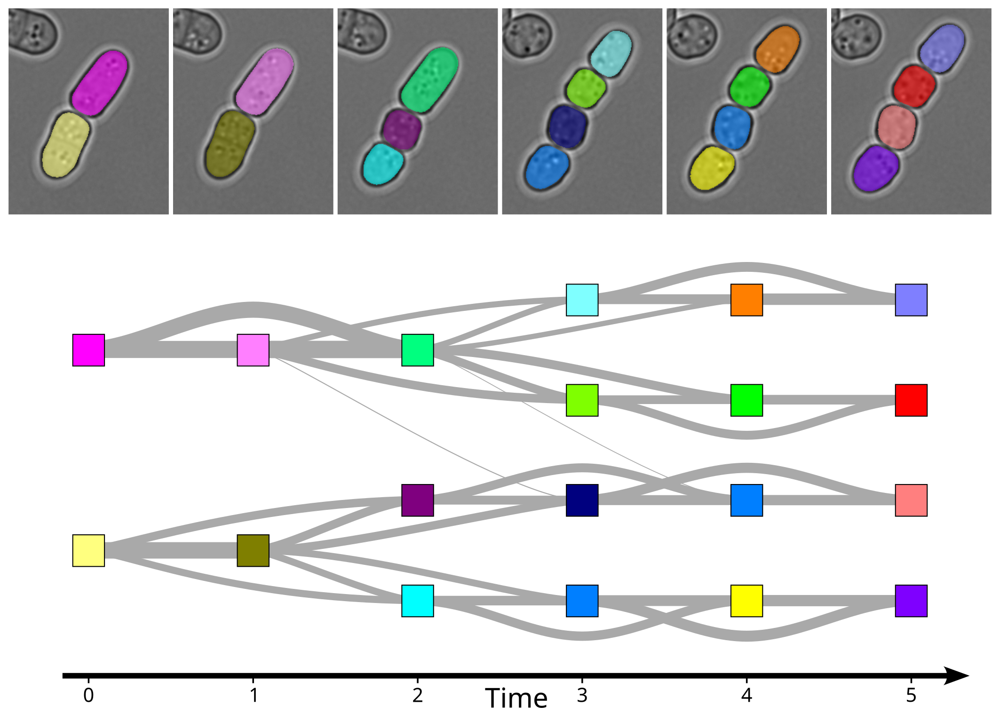
  <figcaption>Figure 2: . Top: mask with labelled regions (color) overlaid on top of bright-field image. Bottom: cell tracking graph (obtained with Nt=2). Vertex color denotes the corresponding labelled region and edge thickness denotes the overlap area. Horizontal axis corresponds to time</figcaption>
</figure>

### Relabelling

As illustrated in Figure 2, labelled region are usually obtained
independently for each frame and labels (colors) do not match across
time frames.  To obtain consistent labels across time, we use the
following iterative relabelling approach (see Figure 3):

1. Labelled regions (vertices) in the first time frame ($t=0$) are
   arbitrarily relabelled using consecutive integer labels $1$, $2$, $3$,
   $\cdots$ (Figure 3A).

2. We then iterate over the remaining time frames (Figure 3B-F).

   * At time frame $t$ ($t>0$), we evaluate a "confusion matrix",
     containing the total overlap area between each labelled region
     (vertex) at time frame t and each labelled region (vertex) at
     previous time frames. Note that all previous time frames ($t-1$,
     $t-2$, $\cdots$) have already been relabelled.
     Each row of the confusion matrix corresponds to a labelled region
     (vertex) in the current frame t, while each column corresponds to
     a labelled region (vertex) in previous frames ($t-1$, $t-2$, $\cdots$,
     $t-N_\text{t}$).
     The entry in the $i$-th row and $j$-th column contain sum of the
     overlap areas between the labelled region (with label
     corresponding to row $i$) and all labelled regions (with label
     corresponding to column $j$) in the previous time frames $t-1$, $t-2$,
     $\cdots$, $t-N_\text{t}$. It is evaluated by summing the overlap areas stored as
     edge attribute for all edges connecting the vertex with label
     corresponding to row $i$ at time frame t to all vertices with label
     corresponding to column $j$ at previous time frames (dark grey
     edges in Figure 3).

   * One to one matching between labels in the current time frame (rows) and labels in previous time frames (columns) is found using *linear sum assignment* (scipy implementation, using the opposite of the confusion matrix as cost matrix). Labels in the current time frame are replaced by the matching labels in previous time frames. If the confusion matrix contains more rows than columns, some labels in current time frame do not match any labels in previous time frames. In this case, unmatched labels are replaced by new labels $m+1$, $m+2$, $\cdots$ (with $m$ the maximum label found across all previous time frames).

The resulting relabelled cell tracking graph and mask are shown in Figure 4

<figure>
  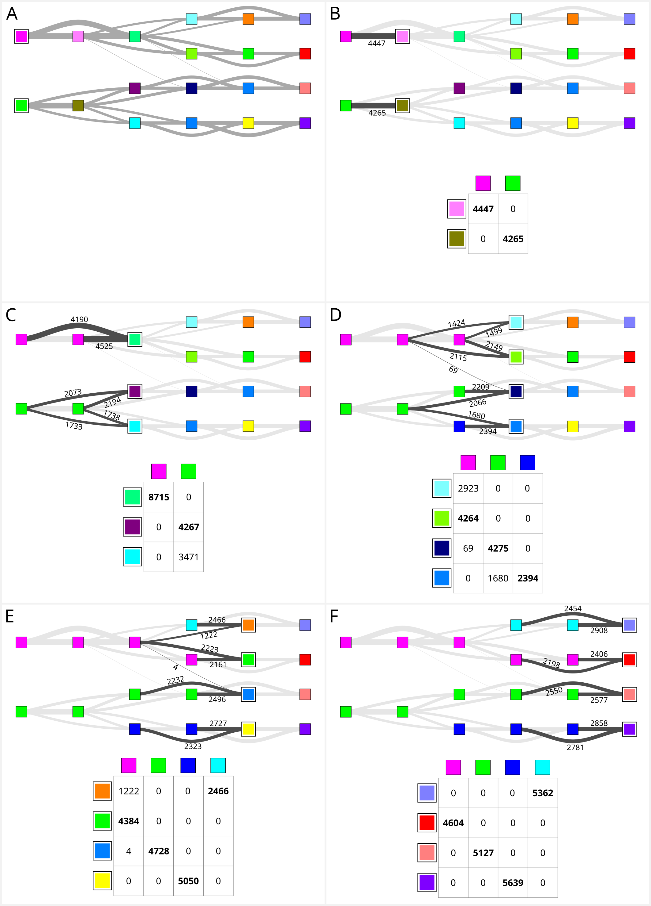
  <figcaption>Figure 3: Iterative relabelling of the cell tracking graph. Panel A: first time frame (t=0) with corresponding vertices highlighted (white outline) and arbitrarily relabelled 1 (magenta) and 2 (green). Panels B-F: each panel corresponds to one time frame (t=1, ..., 5). Vertices corresponding to the current time frame are highlighted (white outline). Edge connecting vertices in the current time frame to vertices in previous time frames are shown in dark grey, together with the corresponding overlap area (black number). The confusion matrix is shown below the graph. Labels associated with each column/row are indicated (color). Matching between labels in the current time frame (rows) and labels in previous time frames (columns) by linear sum assignment is indicated using a bold font.</figcaption>
</figure>

<figure>
  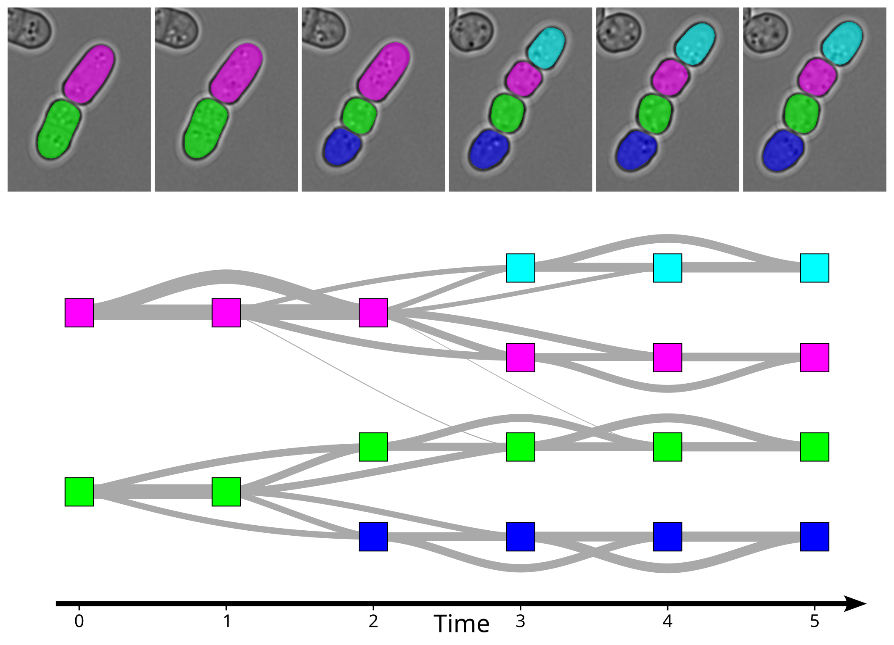
  <figcaption>Figure 4: Relabelled mask and cell tracking graph.</figcaption>
</figure>

### Cell tracking graph: cleaning

The final cell tracking graph is obtained by (see Figure 5):

* Removing edges corresponding to low overlap: Edges with an overlap
  area smaller than a predefined fraction $f$ (20% by default) of any
  the labelled region area corresponding to the source or target
  vertices (dashed edges in Figure 5).

* Adding missing edges between vertices with same label: If two
  consecutive (in time) vertices with same label are not connected by
  an edge, then add the missing edge between these vertices (Figure
  6). This could happen after removing low overlap edges.

* Removing redundant edges: Intuitively, a redundant edges is an edge
  *enclosing* another edge (light grey edges in Figure 5).  More
  precisely, an edge connecting a vertex with label $L_1$ at time
  frame $t_1$ to a vertex with label $L_2$ at time frame $t_2$
  ($t_2>t_1$) is considered as redundant if there is at least one
  other edge connecting a vertex with label $L_1$ at time frame $t'_1$
  to a vertex with label $L_2$ at time frame $t'_2$ and if $t'_1\geq
  t_1$ and $t'_2\leq t_2$.

The resulting final cell tracking graph is shown in Figure 7.

Note: The threshold $f$ used to filter out edges corresponding to low
overlap is called "Min overlap fraction" in the GUI and
`min_overlap_fraction` in the code.

<figure>
  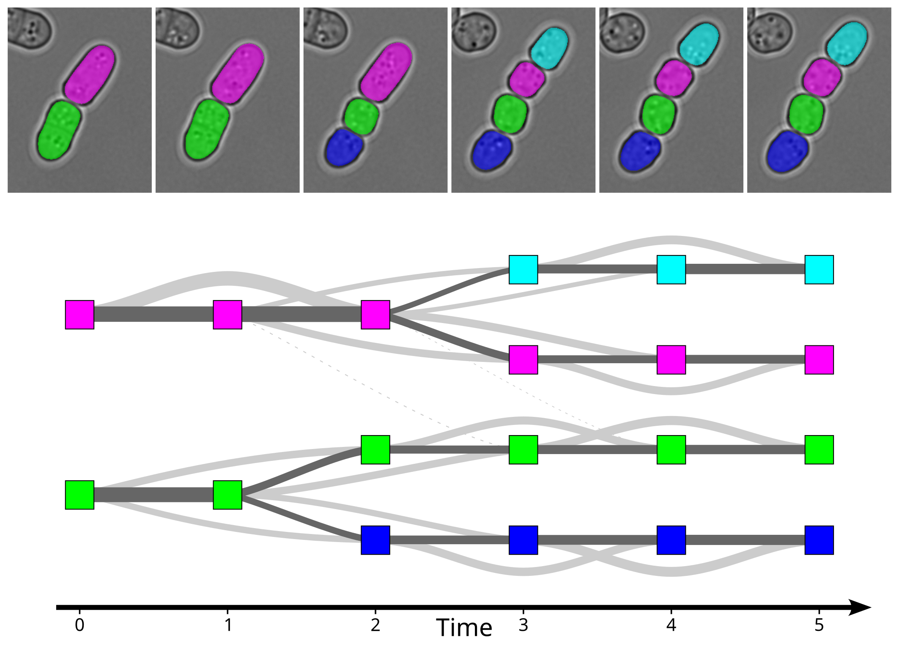
  <figcaption>Figure 5: Cell tracking graph cleaning. Dashed grey lines denote edges corresponding to low overlap and solid light grey lines denotes redundant edges. </figcaption>
</figure>

<figure>
  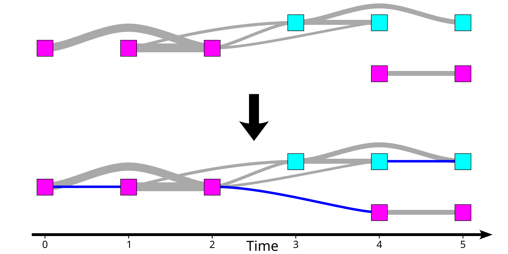
  <figcaption>Figure 6: Adding missing edges (blue). This made-up example is not related to Figure 5.</figcaption>
</figure>

<figure>
  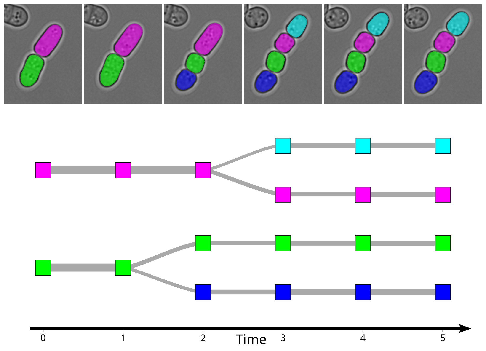
  <figcaption>Figure 7: Final cell tracking graph.</figcaption>
</figure>

## Correction of segmentation errors

### Mask interpolation

Cell segmentation tools (e.g. cellpose) may occasionally produce
errors (e.g. time frames 3 and 4 in Figure 8A).  When segmentation
errors are punctual and surrounded (in time) by stable and error-free
time frames, it is possible to correct the error using the information
contained in neighboring time frames ("interpolating" neighboring time
frames).

To "interpolate" a set of labelled regions (labels 1=green and 2=red
in Figure 8) over a range of time frames (t=3 and t=4 in Figure 8)
using the information contained in $N_\text{i}$ neighbouring frames on each
side ($N_\text{i}=3$ by default), we start by evaluating the signed distance
map for each labelled region and each time frame separately (Figure 8B
and 8D). Each pixel in the distance map contain pixel the signed
distance from this pixel to the boundary of the labelled region, with
positive distance inside the labelled region and negative distances
outside.  For each selected labelled region and each selected time
frame, we evaluate the median of all distance maps for the labelled
region at time frames within $\pm N_\text{i}$ of the selected time frame
(Figure 8C and 8E).

For each selected time frame, new labelled regions are obtained by
assigning each pixel to the label with highest positive median
distance map (Figure 8F). Pixels with negative median distance for all
labelled regions are assigned to the background.

The final mask is obtained by erasing (i.e setting to background
label) selected labelled regions in selected time frames (Figure 8G)
and pasting non-background pixels from the new labelled regions
(Figure 8F) onto the final mask (Figure 8H).

Note: $N_\text{i}$ is called "Max delta frame (interpolation)" in the GUI and `max_delta_frame_interpolation` in the code.

<figure>
  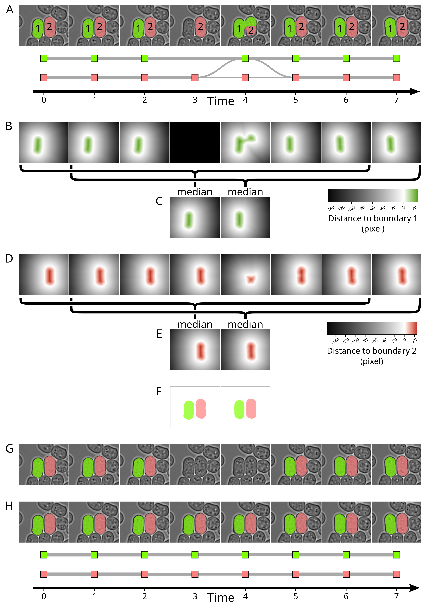
  <figcaption>Figure 8: Mask correction. A: mask (overlaid on top of bright-field image) and corresponding cell tracking graph with segmentation errors in time frames 3 and 4 (made-up example). B: distance maps for labelled region 1. All pixels of the distance map at time frame 3 (missing labelled region) are set to minus infinity. C: median distance maps for labelled region 1. D and E: same as B and C but for labelled region 2. F: updated labelled regions 1 and 2 obtained by combining median distance maps. G: original mask (A) after setting labelled regions 1 and 2 to background for selected time frames 3 and 4. H: Final mask (overlaid on top of bright-field image) and corresponding cell tracking graph after merging masks F and G.</figcaption>
</figure>

### Automatic correction of punctual defects

The previous "mask interpolation" method can be applied to any user
selected set of labelled regions and time frames.
However, it may not give reasonable results if the labelled regions
are not stable enough within $\pm N_\text{i}$ time frames around the
frames to be corrected.

Intuitively, this method should work best for punctual segmentation
errors (i.e. spanning only few time frames), surrounded by enough stable and
error-free time frames.
To automatically find this type of segmentation defects, we use the
information contained in the cell tracking graph:

**Stable regions**: Intuitively, a stable region of the cell tracking graph is a series of vertices in consecutive time frames (no missing time frame), all corresponding to the same mask label, each with a unique incoming and a unique outgoing edge (no branching).

More precisely, we start by flagging all edges of the cell tracking graph as *stable* or *not stable*.
An edge is defined as stable if and only if it satisfies all the following criteria (Figure 9):

* Its source and target vertices correspond to the same mask label.
* Its source and target vertices are in consecutive frames.
* Its source vertex has a unique outgoing edge (this edge) and its target vertex has a unique incoming edge (this edge).
* The overlap between labelled regions corresponding to source and target vertices is larger than a predefined fraction $f$ (90% by default) of any the labelled region area corresponding to the source or target vertices.

Examples of *not stable* edges are shown in Figure 9(blue letters):

* Edge (a) is not stable because its source vertex has two outgoing edges.
* Edge (b) is not stable because the overlap between labelled regions corresponding to source and target vertices is too low.
* Edge (c) is not stable because its source and target vertices are not in consecutive frames.
* Edge (d) is not stable because its target vertex has two incoming edges.
* Edge (e) is not stable because its source and target vertices do have same label (color) and its target vertex has two incoming edges.

<figure>
  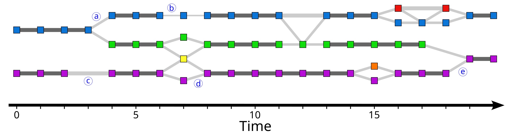
  <figcaption>Figure 9: Examples of stable (dark grey) and not stable (light grey) edges. Vertex color denotes the corresponding label and edge thickness denotes the overlap area. </figcaption>
</figure>

Stable regions are found as the connected components of the subgraph induced by all *stable* edges. The size of each stable region is measured as the number of vertices in connected component (Figure 10).

<figure>
  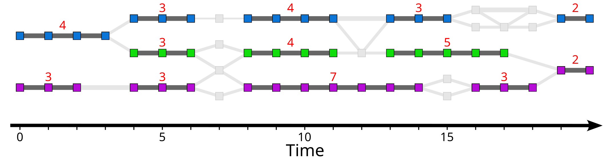
  <figcaption>Figure 10: Size (red text) of stable regions (dark grey edges, colored vertices).</figcaption>
</figure>

**Punctual defects**: Candidate defects are found as the connected components of the subgraph induced by all *not stable* edges (ignoring trivial components of size 1).

This initial list of candidate defects (connected components) is then filtered out to keep only punctual defects surrounded by stable regions, satisfying all the following criteria (see Figure 11):

* The time frame interval covered by the connected component is not larger than $N_\text{d}+2$ frames, where $N_\text{d}$ is a user specified maximum defect size  (2 by default). I.e. the defect is punctual.
* The set of labels associated with vertices in the first time frame of the connected component is identical to the set of labels associated with vertices in the last time frame of the connected component. I.e. the defect is stable, in the sense that the same segmented objects are present before and after the defect.
* Each vertex in first and in last time frame of the connected component belongs to a stable region (see above) of size $\geq N_\text{s}$, where $N_\text{s}$ is a user specified minimum stable region size (3 by default). I.e. the defect is surrounded by stable regions.

Figure 11 and 12 show exemples of candidate defects. For $N_\text{d}=2$ and $N_\text{s}=3$, the following candidate defects would be filtered out:

* Candidate defect (a): it does not have the same set of labels in first frame (blue) and in last frame (blue and green). Note that this candidate defect corresponds to a cell division (i.e. not a defect).
* Candidate defect (d): it covers 5 frames ($>N_\text{d}+2$) and the vertex in last time frame belongs to a stable region of size 2 ($<N_\text{s}$). Note that with $N_\text{d}\geq 3$ this candidate defect would not be filtered out.
* Candidate defect (h): it does not have the same set of labels in first frame (green and purple) and in last frame (purple) and the vertex in last time frame belongs to a stable region of size 2 ($<N_\text{s}$). Note that this candidate defect corresponds to cell fusion with a labelled region missing (green, time frame 18), which cannot be corrected by this method.

<figure>
  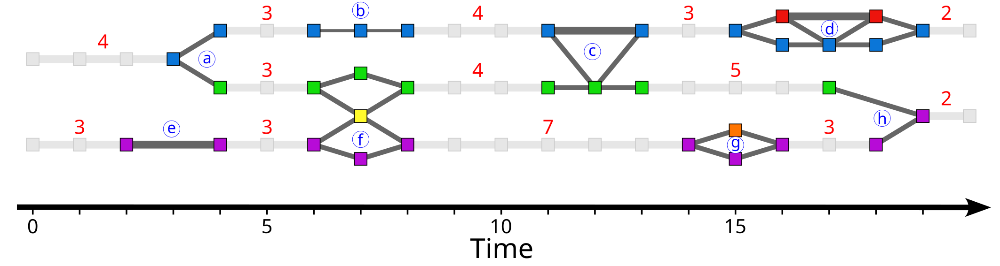
  <figcaption>Figure 11: Candidate defects (dark grey edges, colored vertices, identified with blue letters). Sizes of neighboring stable regions are indicated in red. </figcaption>
</figure>

<figure>
  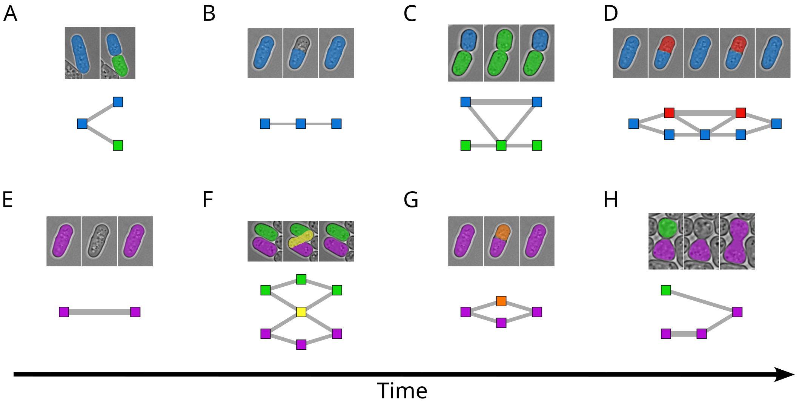
  <figcaption>Figure 12: Labelled regions (made-up examples) corresponding to the candidate defects in Figure 11. </figcaption>
</figure>

Finally, for each remaining defect in the list, the  mask interpolation method described in the previous section is applied to the list of all labels appearing in the defect, for all time frames covered by the defect except first and last time frame (Figure 13).

<figure>
  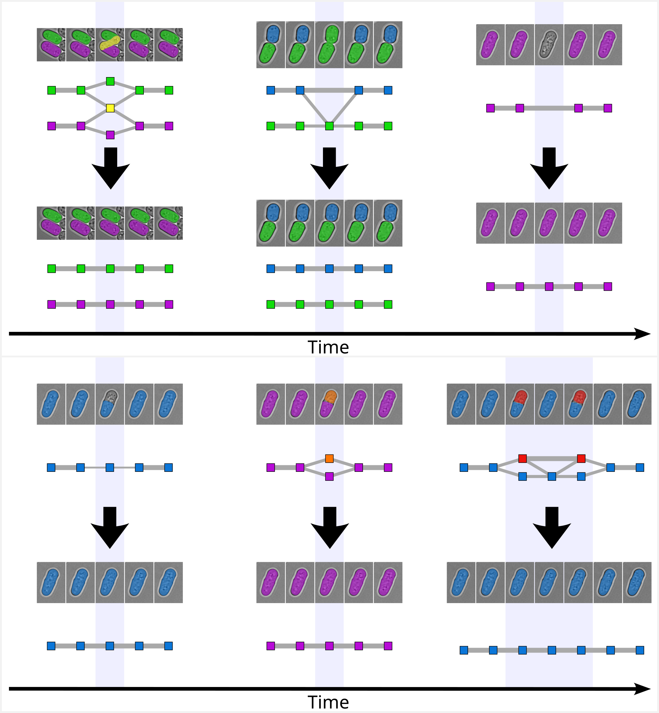
  <figcaption>Figure 13: Mask interpolation method applied to punctual defects (figure 11). The mask interpolation method is applied to all labels appearing in the defect and all highlighted time frames (light blue).</figcaption>
</figure>

Notes:

* $f$ is called "Stable overlap fraction" in the GUI and `stable_overlap_fraction` in the code.
* $N_\text{d}$ is called "Max defect size" in the GUI and `nframes_defect` in the code.
* $N_\text{s}$ is called "Min stable size" in the GUI and `nframes_stable` in the code.
* Ideally, the user defined parameters should satisfy $N_\text{d}\leq N_\text{i}\leq N_\text{s}$ (with $N_\text{i}$ the size of the neighboring region used for mask interpolation).

## Implementation

* Python ([https://www.python.org/](https://www.python.org/)).
* OpenCV ([https://opencv.org/](https://opencv.org/)).
* igraph ([https://igraph.org/](https://igraph.org/)).
* numpy ([https://numpy.org/](https://numpy.org/)).
* SciPy ([https://scipy.org/](https://scipy.org/)).

For the GUI:

* Napari ([https://napari.org](https://napari.org)).
* Qt ([https://www.qt.io/](https://www.qt.io/)).
