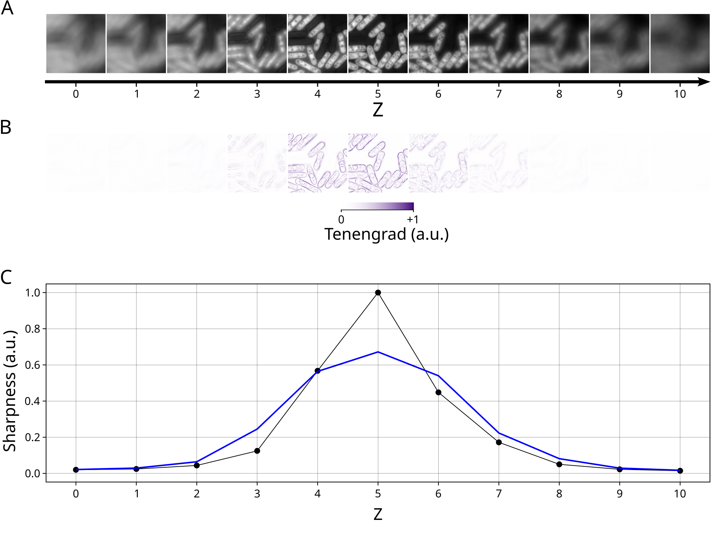

# Methods

## Z-Projection

We consider the problem of reducing a Z-stack of 2D images to a unique 2D image (Z-projection).

The value $v(x,y)$ of the pixel at position $(x,y)$ in the new image is obtained by summarizing the values of the pixels at the same position over all Z sections (or a subset of Z sections) using a given summary statistics (e.g. mean, median, max,...).

The subset of Z sections used for projection can be:

* all Z sections.
* a fixed range of Z sections.
* a range of Z sections around the Z section with best focus.
* only the Z section with best focus.

### All Z sections

All Z sections are used for the projection.

### Fixed range of Z sections

The subset of Z sections used for projection is chosen as all Z sections within the fixed interval $Z\in[Z_\text{min},Z_\text{max}]$, with user-defined $Z_\text{min}$ and $Z_\text{max}$.

Note:

* $Z_\text{min}$ and $Z_\text{max}$ are called "From" and "To" in the GUI and `zrange` or `projection_zrange` in the code (tuple of length 2).

### Range of Z sections around the Z section with best focus.

The subset of Z sections used for projection is chosen as all Z sections within a user specified window around the Z section with best focus. I.e. Z sections with $Z\in \{Z_\text{best}-\Delta_Z,Z_\text{best}-\Delta_Z +1,\cdots,Z_\text{best}+\Delta_Z\}$, where $Z_\text{best}$ corresponds to the Z-section with best focus and $\Delta_Z$ is the size of the Z window.

If $Z_\text{best}$ and $\Delta_Z$ are such that some values in $\{Z_\text{best}-\Delta_Z,Z_\text{best}-\Delta_Z +1,\cdots,Z_\text{best}+\Delta_Z\}$ are outside the range of Z sections existing in the image, then the set is shifted towards valid values of Z.
E.g. a Z-stack with 11 sections (Z=0, 1, ..., 10), $\Delta_Z=3$ and $Z_\text{best}=1$: The set of Z sections to be used for projection is $\{-2,-1,0,1,2,3,4\}$, which contains invalid values (-2 and -1). It is thus shifted in the positive Z direction to avoid negative values $\{0,1,2,3,4,5,6\}$ 

To estimate $Z_\text{best}$ (see Figure 1 and 2), the tenengrad
$$T(x,y) = \sqrt{\left(\frac{\partial v(x,y)}{\partial x}\right)^2 + \left(\frac{\partial v(x,y)}{\partial y}\right)^2}$$
of each Z section is estimated using Sobel operators of size 3x3. The tenengrad can be interpreted as a measure of the local slope. In particular, it is large for region of the image with sharp variations (such as edges) and zero for regions with constant pixel intensities.

The "sharpness" is then estimated, for each Z, as the variance of the tenengrad of the corresponding Z section (Figure 1C and 2C).
The sharpness is then smoothed using a running mean with window of size 3.
Finally, $Z_\text{best}$ is obtained as the $Z$ at which the smoothed sharpness reaches its maximum.

<figure>
  
  <figcaption>Figure 1: determination of Z section with best focus. Panel A: Z sections of a bright-field image. Panel B: Tenengrad of the Z sections. Panel C: Sharpness of each Z section (black points) as a function of Z together with the smoothed sharpness (blue).</figcaption>
</figure>

<figure>
  
  <figcaption>Figure 2: same as Figure 1 but with a fluorescence image.</figcaption>
</figure>

Note:

* The window size $\Delta_Z$ is called "Projection range" in the GUI and `zrange` or `projection_zrange` in the code (integer).

### Z section with best focus

The stack of Z sections is simply replaced by the Z section with best focus (obtained as described above).

## Implementation

* Python ([https://www.python.org/](https://www.python.org/)).
* OpenCV ([https://opencv.org/](https://opencv.org/)).
* numpy ([https://numpy.org/](https://numpy.org/)).
* SciPy ([https://scipy.org/](https://scipy.org/)).

